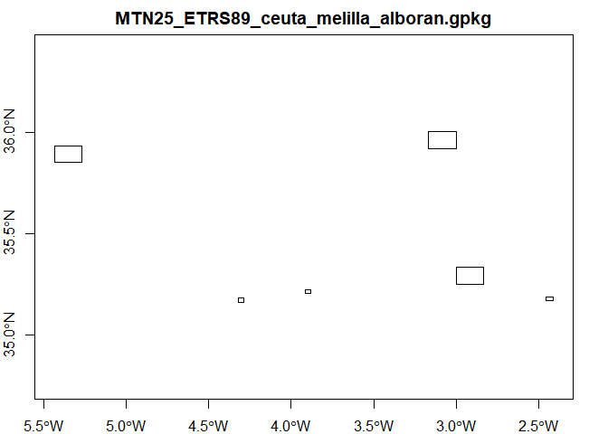
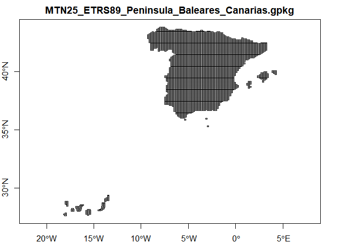
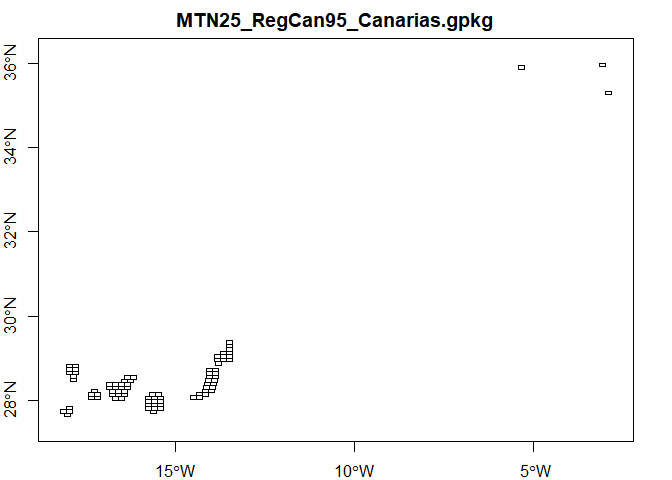
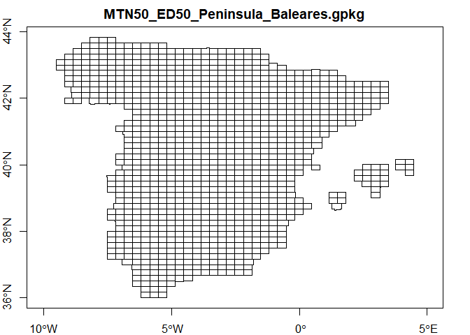
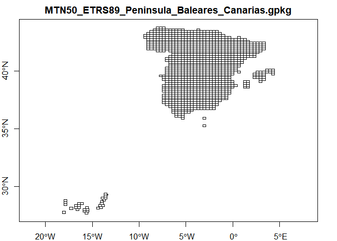
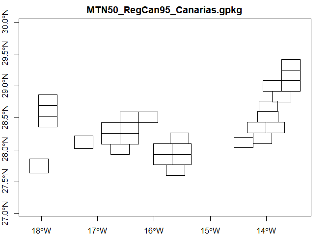

MTN Grids
================

-   [DESCRIPCIÓN DE LOS DISTINTOS JUEGOS DE CUADRÍCULAS CARTOGRÁFICAS
    (ES)](#descripción-de-los-distintos-juegos-de-cuadrículas-cartográficas-es)
-   [DESCRIPTION OF THE DIFFERENT CARTOGRAPHIC GRID ITEMS
    (EN)](#description-of-the-different-cartographic-grid-items-en)
-   [Table of files](#table-of-files)
-   [Preview](#preview)

**Updated: 2021-11-30**

Data Source: <https://centrodedescargas.cnig.es/>

## DESCRIPCIÓN DE LOS DISTINTOS JUEGOS DE CUADRÍCULAS CARTOGRÁFICAS (ES)

-   **MTN25_ED50_Peninsula_Baleares.shp**

    Cuadrícula del MTN25 correspondiente a la Península e Islas
    Baleares, en ED50 y coordenadas geográficas (longitud, latitud) Se
    trata de la cuadrícula real del MTN25, es decir, aquella que divide
    a la serie impresa actual del mapa, teniendo en cuenta hojas
    especiales e irregularidades.

-   **MTN50_ED50_Peninsula_Baleares.shp**

    Cuadrícula del MTN50 correspondiente a la Península e Islas
    Baleares, en ED50 y coordenadas geográficas (longitud, latitud) Se
    trata de la cuadrícula real del MTN50, es decir, aquella que divide
    a la serie impresa actual del mapa, teniendo en cuenta hojas
    especiales e irregularidades.

-   **MTN25_ETRS89_ceuta_melilla_alboran.shp**

    Cuadrícula del MTN25 correspondiente a Ceuta, Melilla, Alborán y
    posesiones españolas en el Norte de África, ajustada al nuevo
    sistema geodésico de referencia oficial ETRS89, en coordenadas
    geográficas (longitud, latitud).

-   **MTN25_ETRS89_Peninsula_Baleares_Canarias.shp**

    Cuadrícula real del MTN25 correspondiente a la Península, Baleares y
    Canarias, ajustada al nuevo sistema geodésico de referencia oficial
    ETRS89, en coordenadas geográficas (longitud, latitud).

-   **MTN50_ETRS89_Peninsula_Baleares_Canarias.shp**

    Cuadrícula real del MTN50 correspondiente a la Península, Baleares y
    Canarias, ajustada al nuevo sistema geodésico de referencia oficial
    ETRS89, en coordenadas geográficas (longitud, latitud).

-   **MTN25_RegCan95_Canarias.shp**

    Cuadrícula del MTN25 correspondiente a Canarias, en REGCAN95
    (compatible WGS84) y coordenadas geográficas (longitud, latitud). Se
    trata de la cuadrícula real del MTN25, es decir, aquella que divide
    a la serie impresa actual del mapa, teniendo en cuenta la
    distribución especial de las hojas de Canarias.

-   **MTN50_RegCan95_Canarias.shp**

    Cuadrícula del MTN50 correspondiente a Canarias, en REGCAN95
    (compatible WGS84) y coordenadas geográficas (longitud, latitud). Se
    trata de la cuadrícula real del MTN50, es decir, aquella que divide
    a la serie impresa actual del mapa, teniendo en cuenta la
    distribución especial de las hojas de Canarias.

## DESCRIPTION OF THE DIFFERENT CARTOGRAPHIC GRID ITEMS (EN)

-   **MTN25_ED50_Peninsula_Baleares.shp**

    MTN25 grid corresponding to the Peninsula and Balearic Islands, in
    ED50 and geographical coordinates (longitude, latitude) This is the
    real MTN25 grid, that is, the one that divides the current printed
    series of the map, taking into account special sheets and
    irregularities.

-   **MTN50_ED50_Peninsula_Baleares.shp**

    MTN50 grid corresponding to the Peninsula and Balearic Islands, in
    ED50 and geographical coordinates (longitude, latitude) This is the
    real MTN50 grid, that is, the one that divides the current printed
    series of the map, taking into account special sheets and
    irregularities.

-   **MTN25_ETRS89_ceuta_melilla_alboran.shp**

    MTN25 grid corresponding to Ceuta, Melilla, Alboran and Spanish
    territories in North Africa, adjusted to the new official geodetic
    reference system ETRS89, in geographical coordinates (longitude,
    latitude).

-   **MTN25_ETRS89_Peninsula_Baleares_Canarias.shp**

    MTN25 real grid corresponding to the Peninsula, the Balearic Islands
    and the Canary Islands, adjusted to the new ETRS89 official
    reference geodetic system, in geographical coordinates (longitude,
    latitude).

-   **MTN50_ETRS89_Peninsula_Baleares_Canarias.shp**

    MTN50 real grid corresponding to the Peninsula, the Balearic Islands
    and the Canary Islands, adjusted to the new ETRS89 official
    reference geodetic system, in geographical coordinates (longitude,
    latitude).

-   **MTN25_RegCan95_Canarias.shp**

    MTN25 grid corresponding to the Canary Islands, in REGCAN95 (WGS84
    compatible) and geographic coordinates (longitude, latitude). It is
    the real MTN25 grid, that is, the one that divides the current
    printed series of the map, taking into account the special
    distribution of the Canary Islands sheets.

-   **MTN50_RegCan95_Canarias.shp**

    MTN50 grid corresponding to the Canary Islands, in REGCAN95 (WGS84
    compatible) and geographic coordinates (longitude, latitude). This
    is the real grid of the MTN50, that is, the one that divides the
    current printed series of the map, taking into account the special
    distribution of the Canary Islands sheets.

## Table of files

Full reference of each dataset in the [source](./source/) folder.

There are 7 files available:

| file                                          |
|:----------------------------------------------|
| MTN25_ED50_Peninsula_Baleares.gpkg            |
| MTN25_ETRS89_ceuta_melilla_alboran.gpkg       |
| MTN25_ETRS89_Peninsula_Baleares_Canarias.gpkg |
| MTN25_RegCan95_Canarias.gpkg                  |
| MTN50_ED50_Peninsula_Baleares.gpkg            |
| MTN50_ETRS89_Peninsula_Baleares_Canarias.gpkg |
| MTN50_RegCan95_Canarias.gpkg                  |

## Preview

