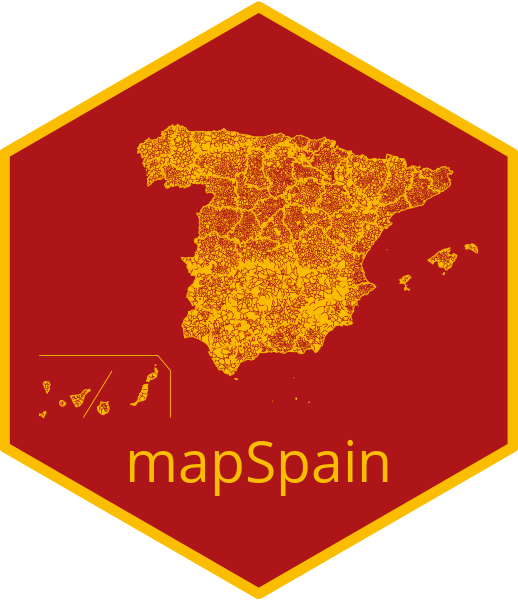

```{r, include = FALSE}
knitr::opts_knit$set(
  progress = TRUE,
  base.url = "https://raw.githubusercontent.com/ropenspain/mapSpain/master/"
)

knitr::opts_chunk$set(
  collapse = TRUE,
  tidy = "styler",
  comment = "#>",
  fig.path = "img/README-",
  warning = FALSE,
  message = FALSE,
  dev = "ragg_png",
  dpi = 300,
  out.width = "100%"
)
```

# mapSpain 

<!-- badges: start -->

[](https://ropenspain.es/)
[](https://CRAN.R-project.org/package=mapSpain)
[](https://cran.r-project.org/web/checks/check_results_mapSpain.html)
[](https://CRAN.R-project.org/package=mapSpain)
[](https://ropenspain.r-universe.dev/)
[](https://github.com/rOpenSpain/mapSpain/actions?query=workflow%3AR-CMD-check)
[](https://codecov.io/gh/rOpenSpain/mapSpain)
[](https://doi.org/10.5281/zenodo.4318024)
[](https://www.repostatus.org/#active)

<!-- badges: end -->

[**mapSpain**](https://ropenspain.github.io/mapSpain/) is a package that
provides spatial `sf` objects of the administrative boundaries of Spain,
including CCAA, provinces and municipalities.

**mapSpain** also provides a leaflet plugin to be used with the [`leaflet`
package](https://rstudio.github.io/leaflet/), that loads several basemaps of
public institutions of Spain, and the ability of downloading and processing
static tiles.

Full site with examples and vignettes on
<https://ropenspain.github.io/mapSpain/>

## Installation

Install **mapSpain** from
[**CRAN**](https://CRAN.R-project.org/package=mapSpain):

```{r, eval = FALSE}
install.packages("mapSpain")
```

You can install the developing version of **mapSpain** using the
[r-universe](https://ropenspain.r-universe.dev/ui#builds):

```{r, eval = FALSE}
# Enable this universe
options(repos = c(
  ropenspain = "https://ropenspain.r-universe.dev",
  CRAN = "https://cloud.r-project.org"
))

install.packages("mapSpain")
```

Alternatively, you can install the developing version of **mapSpain** with:

```{r, eval = FALSE}
library(remotes)
install_github("rOpenSpain/mapSpain")
```

## Usage

This script highlights some features of **mapSpain** :

```{r static}

library(mapSpain)

census <- mapSpain::pobmun19

# Extract CCAA from base dataset

codelist <- mapSpain::esp_codelist

census <-
  unique(merge(census, codelist[, c("cpro", "codauto")], all.x = TRUE))

# Summarize by CCAA
census_ccaa <-
  aggregate(cbind(pob19, men, women) ~ codauto, data = census, sum)

census_ccaa$porc_women <- census_ccaa$women / census_ccaa$pob19
census_ccaa$porc_women_lab <-
  paste0(round(100 * census_ccaa$porc_women, 2), "%")

# Merge into spatial data

CCAA_sf <- esp_get_ccaa()
CCAA_sf <- merge(CCAA_sf, census_ccaa)
Can <- esp_get_can_box()


# Plot with tmap
library(tmap)

tm_shape(CCAA_sf) +
  tm_polygons(
    "porc_women",
    border.col = "grey70",
    title = "Porc. women",
    palette = "Blues",
    alpha = 0.7,
    legend.format = list(
      fun = function(x) {
        sprintf("%1.1f%%", 100 * x)
      }
    )
  ) +
  tm_shape(CCAA_sf, point.per = "feature") +
  tm_text("porc_women_lab", remove.overlap = TRUE, shadow = TRUE) +
  tm_shape(Can) +
  tm_lines(col = "grey70") +
  tm_layout(legend.position = c("LEFT", "center"))
```

You can combine `sf` objects with static tiles

```{r tile, fig.width=5, fig.height=5.1}

# Get census
census <- mapSpain::pobmun19
census$porc_women <- census$women / census$pob19

# Get shapes
shape <- esp_get_munic_siane(region = "Segovia", epsg = 3857)
provs <- esp_get_prov_siane(epsg = 3857)

shape_pop <- merge(shape,
  census,
  by = c("cpro", "cmun"),
  all.x = TRUE
)


tile <-
  esp_getTiles(shape_pop,
    type = "IGNBase.Todo",
    zoom = 10,
    bbox_expand = 0.1
  )

# Plot


library(tmap)

tm_shape(tile, raster.downsample = FALSE) +
  tm_rgb() +
  tm_shape(shape_pop) +
  tm_fill("porc_women",
    palette = "RdYlBu",
    title = "",
    n = 8,
    alpha = 0.6,
    showNA = FALSE,
    legend.format = list(
      fun = function(x) {
        sprintf("%1.0f%%", 100 * x)
      },
      text.separator = "-"
    )
  ) +
  tm_shape(provs) +
  tm_credits("Source: INE",
    fontface = "bold",
    position = c("left", "bottom")
  ) +
  tm_borders(alpha = 0.5) +
  tm_layout(
    frame = FALSE,
    main.title = "Share of women in Segovia by town (2019)",
    main.title.fontface = "bold",
    main.title.size = 0.8,
    legend.position = c("right", "bottom"),
    legend.bg.color = "white",
    legend.bg.alpha = 0.7
  )
```

## mapSpain and giscoR

If you need to plot Spain along with another countries, consider using
[**giscoR**](https://dieghernan.github.io/giscoR/) package, that is installed as a
dependency when you installed **mapSpain**. A basic example:

```{r giscoR, fig.asp=1}

library(giscoR)

# Set the same resolution for a perfect fit

res <- "03"

# Same crs
target_crs <- 3035

all_countries <- gisco_get_countries(
  resolution = res,
  epsg = target_crs
)
eu_countries <- gisco_get_countries(
  resolution = res, region = "EU",
  epsg = target_crs
)
ccaa <- esp_get_ccaa(
  moveCAN = FALSE, resolution = res,
  epsg = target_crs
)

# Plot
library(tmap)

tm_shape(all_countries, bbox = c(23, 14, 67, 54) * 10e4) +
  tm_graticules(col = "#DFDFDF", alpha = 0.7) +
  tm_fill("#DFDFDF") +
  tm_shape(eu_countries) +
  tm_polygons("#FDFBEA", border.col = "#656565") +
  tm_shape(ccaa) +
  tm_polygons("#C12838", border.col = "grey80", lwd = 0.1)
```

## A note on caching

Some data sets and tiles may have a size larger than 50MB. You can use
**mapSpain** to create your own local repository at a given local directory
passing the following option:

```{r, eval = FALSE}
esp_set_cache_dir("./path/to/location")
```

When this option is set, **mapSpain** would look for the cached file and it will
load it, speeding up the process.

## Plotting `sf` objects

Some packages recommended for visualization are:

-   [**tmap**](https://mtennekes.github.io/tmap/)
-   [**mapsf**](https://riatelab.github.io/mapsf/)
-   [**ggplot2**](https://github.com/tidyverse/ggplot2) +
    [**ggspatial**](https://github.com/paleolimbot/ggspatial)
-   [**leaflet**](https://rstudio.github.io/leaflet/)

## Citation

Please use the following when citing **mapSpain**:

```{r citation}

citation("mapSpain")
```


## Contribute

Check the GitHub page for 
[source code](https://github.com/ropenspain/mapSpain/).

## Copyright notice

This package uses data from CartoBase SIANE, provided by Instituto Geográfico
Nacional:

> Atlas Nacional de España (ANE) [CC BY
> 4.0](https://creativecommons.org/licenses/by/4.0/deed.en)
> [ign.es](https://www.ign.es/)

See <https://github.com/rOpenSpain/mapSpain/tree/sianedata>

This package uses data from **GISCO**. GISCO
[(FAQ)](https://ec.europa.eu/eurostat/web/gisco/faq) is a geospatial open data
repository including several data sets at several resolution levels.

*From GISCO \> Geodata \> Reference data \> Administrative Units / Statistical
Units*

> When data downloaded from this page is used in any printed or electronic
> publication, in addition to any other provisions applicable to the whole
> Eurostat website, data source will have to be acknowledged in the legend of
> the map and in the introductory page of the publication with the following
> copyright notice:
>
> EN: © EuroGeographics for the administrative boundaries
>
> FR: © EuroGeographics pour les limites administratives
>
> DE: © EuroGeographics bezüglich der Verwaltungsgrenzen
>
> For publications in languages other than English, French or German, the
> translation of the copyright notice in the language of the publication shall
> be used.

If you intend to use the data commercially, please contact EuroGeographics for
information regarding their license agreements.
