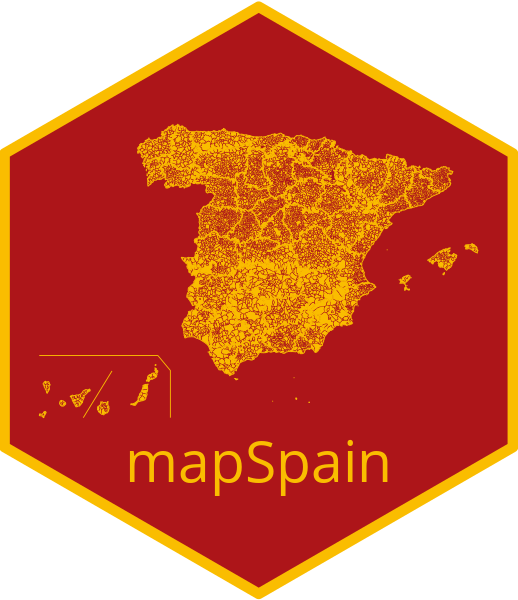

# mapSpain 

<!-- badges: start -->

[](https://CRAN.R-project.org/package=mapSpain)
[](https://cran.r-project.org/web/checks/check_results_mapSpain.html)
[](https://github.com/rOpenSpain/mapSpain/actions?query=workflow%3AR-CMD-check)
[](https://codecov.io/gh/rOpenSpain/mapSpain)
[](https://www.tidyverse.org/lifecycle/#experimental)
[](https://doi.org/10.5281/zenodo.4318024)
<!-- badges: end -->

**[mapSpain](https://ropenspain.github.io/mapSpain/)** is a package that
provides spatial `sf` objects of the administrative boundaries of Spain,
including CCAA, provinces and municipalities.

**mapSpain** also provides a leaflet plugin to be used with the
[`leaflet` package](https://rstudio.github.io/leaflet/), that loads
several basemap of public institutions of Spain, and the ability of
downloading and processing static tiles.

Full site with examples and vignettes on
<https://ropenspain.github.io/mapSpain/>

## Installation

Install `mapSpain` from
[**CRAN**](https://CRAN.R-project.org/package=mapSpain):

``` r
install.packages("mapSpain")
```

You can install the developing version of `mapSpain` with:

``` r
library(remotes)
install_github("rOpenSpain/mapSpain")
```

## Usage

This script highlights some features of `mapSpain`:

``` r
library(mapSpain)
library(sf)

census <- mapSpain::pobmun19

# Paste CCAA
census <-
  unique(merge(census, esp_codelist[, c("cpro", "codauto")], all.x = TRUE))

# Summarize
census_ccaa <-
  aggregate(cbind(pob19, men, women) ~ codauto, data = census, sum)

census_ccaa$porc_women <- census_ccaa$women / census_ccaa$pob19

CCAA.sf <- esp_get_ccaa()

# Merge data
CCAA.sf <- merge(CCAA.sf, census_ccaa)


# Choropleth map

library(cartography)
br <- getBreaks(CCAA.sf$porc_women, method = "pretty")
pal <- hcl.colors(length(br) - 1,
  palette = "Blues 3",
  rev = TRUE,
  alpha = 0.8
)
choroLayer(
  CCAA.sf,
  var = "porc_women",
  breaks = br,
  legend.values.rnd = 3,
  legend.pos = "bottomright",
  col = pal,
  border = NA,
  legend.title.txt = "% women"
)

# Add lines

CCAAbox <- esp_get_can_box()

plot(CCAAbox, add = TRUE, col = pal[length(pal)])
```

<!-- -->

You can combine `POLYGONS` with static tiles

``` r
library(mapSpain)
library(sf)

census <- mapSpain::pobmun19
census$porc_women <- census$women / census$pob19

census$municode <- paste0(census$cpro, census$cmun)

Asturias.sf <- esp_get_munic(region = "Asturias")

Asturias.pop <-
  merge(Asturias.sf, census, by.x = "LAU_CODE", by.y = "municode")

# Get tiles

Asturias.pop <- st_transform(Asturias.pop, 3857)

tile <-
  esp_getTiles(Asturias.pop,
    type = "IGNBase.Todo",
    zoom = 8
  )


# Plot
par(mar = c(0, 0, 0, 0))
library(cartography)

tilesLayer(tile)
br <- getBreaks(Asturias.pop$porc_women, method = "kmeans")


choroLayer(
  Asturias.pop,
  var = "porc_women",
  breaks = br,
  col = hcl.colors(
    n = length(br) - 1,
    palette = "inferno",
    rev = TRUE,
    alpha = 0.4
  ),
  add = TRUE,
  legend.values.rnd = 2,
  border = NA,
  legend.pos = "n"
)

legendChoro(
  pos = "bottomright",
  breaks = br,
  values.rnd = 2,
  horiz = TRUE,
  nodata = FALSE,
  col = hcl.colors(
    n = length(br) - 1,
    palette = "inferno",
    rev = TRUE
  ),
  title.txt = "% women"
)
```

<!-- -->

### A note on caching

Some data sets and tiles may have a size larger than 50MB. You can use
`mapSpain` to create your own local repository at a given local
directory passing the following option:

``` r
options(mapSpain_cache_dir = "./path/to/location")
```

When this option is set, `mapSpain` would look for the cached file and
it will load it, speeding up the process.

### Plotting `sf` objects

Some packages recommended for visualization are:

  - [`tmap`](https://mtennekes.github.io/tmap/)  
  - [`cartography`](http://riatelab.github.io/cartography/docs/)
  - [`ggplot2`](https://github.com/tidyverse/ggplot2) +
    [`ggspatial`](https://github.com/paleolimbot/ggspatial)
  - [`leaflet`](https://rstudio.github.io/leaflet/)

## Contribute

Check the Github page for [source
code](https://github.com/ropenspain/mapSpain/).

## Copyright notice

This package used data from CartoBase SIANE, provided by Instituto
Geográfico Nacional:

> Atlas Nacional de España (ANE) [CC
> BY 4.0](https://creativecommons.org/licenses/by/4.0/deed.en)
> [ign.es](https://www.ign.es/)

This package uses data from **GISCO**. GISCO
[(FAQ)](https://ec.europa.eu/eurostat/web/gisco/faq) is a geospatial
open data repository including several data sets at several resolution
levels.

*From GISCO \> Geodata \> Reference data \> Administrative Units /
Statistical Units*

> When data downloaded from this page is used in any printed or
> electronic publication, in addition to any other provisions applicable
> to the whole Eurostat website, data source will have to be
> acknowledged in the legend of the map and in the introductory page of
> the publication with the following copyright notice:
> 
> EN: © EuroGeographics for the administrative boundaries
> 
> FR: © EuroGeographics pour les limites administratives
> 
> DE: © EuroGeographics bezüglich der Verwaltungsgrenzen
> 
> For publications in languages other than English, French or German,
> the translation of the copyright notice in the language of the
> publication shall be used.

If you intend to use the data commercially, please contact
EuroGeographics for information regarding their license agreements.
