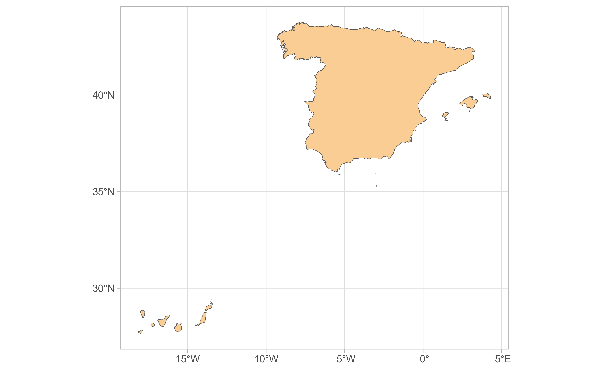
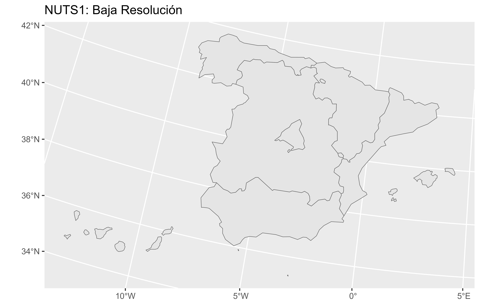
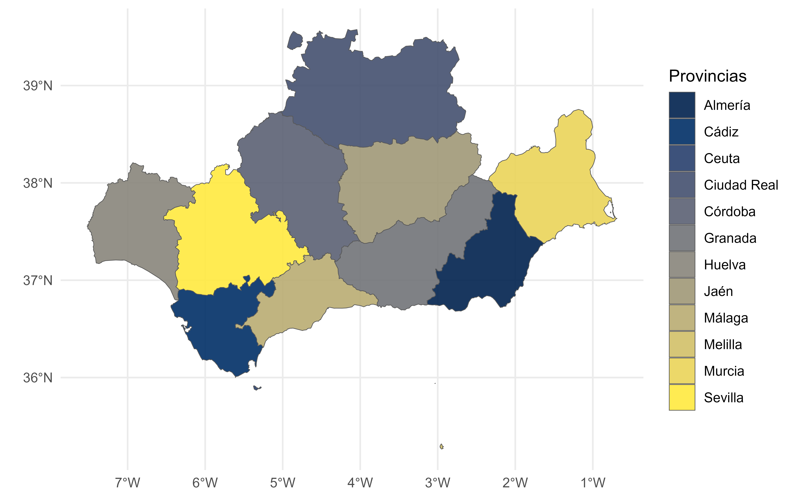
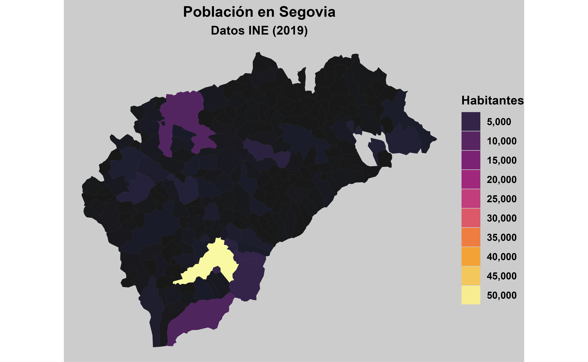

# mapSpain: Mapas de España en R \[Spanish\]

## Bienvenidos a mapSpain

### Motivación

**mapSpain** facilita la creación de mapas de los diferentes niveles
administrativos de España.

Además, permite usar imágenes de servicios WMS/WMTS de forma estática
(como imagen georreferenciada) o dinámica (en mapas Leaflet).

Adicionalmente, **mapSpain** dispone de funciones que permiten
normalizar nombres de las CCAA y provincias, lo que facilita el proceso
de manipulación y transformación de datos (no necesariamente
espaciales).

Las **fuentes de información** empleadas en **mapSpain** son:

- [GISCO](https://ec.europa.eu/eurostat/web/gisco) (Eurostat), vía el
  paquete [**giscoR**](https://ropengov.github.io/giscoR/).
- [Instituto Geográfico Nacional](https://www.ign.es/) (IGN)
- Distintos organismos públicos de España que proporcionan servicios de
  teselas WMTS/WMS
  (<https://www.idee.es/web/idee/segun-tipo-de-servicio>).

Los objetos resultantes se proporcionan en formato `sf` (librería
**sf**) o `SpatRaster` (librería **terra**).

Página web: <https://ropenspain.github.io/mapSpain/>

### Instalación

#### CRAN

``` r
install.packages("mapSpain", dependencies = TRUE)
```

#### Dev version

Usando el [r-universe](https://ropenspain.r-universe.dev/ui#builds):

``` r
# Enable this universe
install.packages("mapSpain",
  repos = c(
    "https://ropenspain.r-universe.dev",
    "https://cloud.r-project.org"
  ),
  dependencies = TRUE
)
```

#### Con pak (desde GitHub)

``` r
install.packages("pak")
pak::pak("rOpenSpain/mapSpain", dependencies = TRUE)
```

### Un ejemplo rápido

``` r
library(mapSpain)
library(tidyverse)

galicia <- esp_get_munic_siane(region = "Galicia") |>
  # Homogeneizo etiquetas
  mutate(Provincia = esp_dict_translate(ine.prov.name, "es"))


ggplot(galicia) +
  geom_sf(aes(fill = Provincia), color = "grey70") +
  labs(title = "Provincias de Galicia") +
  scale_fill_discrete(type = hcl.colors(4, "Blues")) +
  theme_bw()
```


Si exploramos el dataset:

``` r
library(reactable)

reactable(galicia,
  searchable = TRUE, striped = TRUE, filterable = TRUE, height = 350,
  elementId = "munis-galicia"
)
```

### Comparando mapSpain con otras alternativas

Comparamos ahora **mapSpain** con otro paquete que proporciona objetos
`sf` o `SpatVector` de distintos paises:

``` r
library(sf) # manipulación de datos espaciales

# rnaturalearth
library(rnaturalearth)
esp_rnat <- ne_countries("large", country = "Spain", returnclass = "sf") |>
  st_transform(3857)

# mapSpain
esp_mapspain <- esp_get_spain(epsg = 4326) |>
  st_transform(3857)

# geodata (GADM)
library(geodata)
esp_geodata <- geodata::gadm("ES", path = ".", level = 0) |>
  # Convertimos de SpatVector a objeto sf
  sf::st_as_sf() |>
  st_transform(3857)

# geobounds
# https://github.com/dieghernan/geobounds
library(geobounds)
esp_geobounds <- geobounds::gb_get_adm0("ESP", cache_dir = ".") |>
  st_transform(3857)

# Imagen Ría Ferrol
tile <- esp_get_munic_siane(munic = "Ferrol", epsg = 3857) |>
  esp_get_tiles("PNOA", bbox_expand = 0.5, zoommin = 1)

# Prepara el plot
library(tidyterra)


esp_all <- bind_rows(esp_rnat, esp_mapspain, esp_geodata, esp_geobounds)

esp_all$source <- as_factor(c(
  "rnaturalearth",
  "mapSpain", "geodata (GADM)", "geoBoundaries"
))

ggplot(esp_all) +
  geom_spatraster_rgb(data = tile, maxcell = Inf, alpha = 0.5) +
  geom_sf(aes(color = source, linetype = source),
    fill = NA, show.legend = "line",
    linewidth = 0.5, alpha = 0.7
  ) +
  coord_sf(
    crs = 4326, xlim = c(-8.384421, -8.154413), ylim = c(43.43201, 43.59545),
    expand = FALSE
  ) +
  scale_color_manual(values = c("red", "black", "blue", "orange")) +
  scale_linetype_manual(values = c("solid", "dotted", "dashed", "twodash")) +
  theme_void() +
  labs(title = "Ría de Ferrol")
```


- **rnaturalearth**: No capta bien el contorno.
- **mapSpain**: Resultados satisfactorios.
- **GADM** (librería **geodata**): Resultados muy precisos.
- **geoBoundaries** (librería **geobounds**): Resultados satisfactorios.

### Almacenamiento

**mapSpain** es un paquete API que usa recursos web. El comportamiento
por defecto consiste en descargar archivos al directorio temporal
[`tempdir()`](https://rdrr.io/r/base/tempfile.html) para su uso
posterior durante la sesión.

La función
[`esp_set_cache_dir()`](https://ropenspain.github.io/mapSpain/dev/reference/esp_set_cache_dir.md)
permite modificar este comportamiento, estableciendo un directorio de
descarga específico para el usuario. Para hacer esta configuración
persistente se puede emplear el parámetro `install = TRUE`

``` r
esp_set_cache_dir("~/R/mapslib/mapSpain", install = TRUE, verbose = TRUE)

#> ℹ mapSpain cache dir is C:/Users/XXXX/Documents/R/mapslib/mapSpain.

munic <- esp_get_munic_siane(verbose = TRUE)

#> ℹ Cache dir is C:/Users/XXXX/Documents/R/mapslib/mapSpain/siane.
#> ✔ File already cached: C:/Users/XXXX/Documents/R/mapslib/mapSpain/siane/se89_3_admin_muni_a_x.gpkg.
#> ℹ Cache dir is C:/Users/diego/Documents/R/mapslib/GISCO/siane.
#> ✔ File already cached: C:/Users/XXXX/Documents/R/mapslib/mapSpain/siane/se89_3_admin_muni_a_y.gpkg
```

## Diccionario

### Funciones para trabajar con strings

**mapSpain** proporciona dos funciones relacionadas para trabajar con
textos y códigos:

- [`esp_dict_region_code()`](https://ropenspain.github.io/mapSpain/dev/reference/esp_dict.md)
  convierte textos en códigos de CCAA y provincias. Esquemas de
  codificación soportados:
  - ISO2
  - NUTS
  - INE (codauto y cpro)
- [`esp_dict_translate()`](https://ropenspain.github.io/mapSpain/dev/reference/esp_dict.md)
  traduce textos a diferentes idiomas:
  - Castellano
  - Inglés
  - Catalán
  - Gallego
  - Vasco

Estas funciones pueden ser de utilidad en ámbitos más amplios que
necesiten homogeneizar códigos de CCAA y Provincias (Datos COVID ISCII,
etc).

#### `esp_dict_region_code()`

``` r
vals <- c("Errioxa", "Coruna", "Gerona", "Madrid")

esp_dict_region_code(vals, destination = "nuts")
#> [1] "ES23"  "ES111" "ES512" "ES30"
esp_dict_region_code(vals, destination = "cpro")
#> [1] "26" "15" "17" "28"
esp_dict_region_code(vals, destination = "iso2")
#> [1] "ES-RI" "ES-C"  "ES-GI" "ES-MD"

# Desde ISO a otros códigos

iso2vals <- c("ES-M", "ES-S", "ES-SG")
esp_dict_region_code(iso2vals, origin = "iso2")
#> [1] "Madrid"    "Cantabria" "Segovia"

iso2vals <- c("ES-GA", "ES-CT", "ES-PV")

esp_dict_region_code(iso2vals, origin = "iso2", destination = "nuts")
#> [1] "ES11" "ES51" "ES21"

# Soporta diferentes niveles
valsmix <- c("Centro", "Andalucia", "Seville", "Menorca")
esp_dict_region_code(valsmix, destination = "nuts")
#> [1] "ES4"   "ES61"  "ES618" "ES533"

esp_dict_region_code(c("Murcia", "Las Palmas", "Aragón"), destination = "iso2")
#> [1] "ES-MC" "ES-GC" "ES-AR"
```

#### `esp_dict_translate()`

``` r
vals <- c("La Rioja", "Sevilla", "Madrid", "Jaen", "Orense", "Baleares")

esp_dict_translate(vals, lang = "en")
#> [1] "La Rioja"         "Seville"          "Madrid"           "Jaén"            
#> [5] "Ourense"          "Balearic Islands"
esp_dict_translate(vals, lang = "es")
#> [1] "La Rioja" "Sevilla"  "Madrid"   "Jaén"     "Orense"   "Baleares"
esp_dict_translate(vals, lang = "ca")
#> [1] "La Rioja"      "Sevilla"       "Madrid"        "Jaén"         
#> [5] "Ourense"       "Illes Balears"


esp_dict_translate(vals, lang = "eu")
#> [1] "Errioxa"         "Sevilla"         "Madril"          "Jaén"           
#> [5] "Ourense"         "Balear Uharteak"
esp_dict_translate(vals, lang = "ga")
#> [1] "A Rioxa"        "Sevilla"        "Madrid"         "Xaén"          
#> [5] "Ourense"        "Illas Baleares"
```

## Límites políticos

**mapSpain** contiene un set de funciones que permiten obtener límites
políticos a diferentes niveles:

- Todo el país
- [NUTS](https://ec.europa.eu/eurostat/web/nuts/background) (Eurostat):
  Clasificación estadística de Eurostat. Niveles 0 (país), 1, 2 (CCAA) y
  3.
- CCAA
- Provincias
- Municipios

Para CCAA, Provincias y Municipios hay dos versiones: `esp_get_xxxx()`
(fuente: GISCO) y `esp_get_xxxx_siane()` (fuente: IGN).

La información se proporciona en diferentes proyecciones y niveles de
resolución.

``` r
esp <- esp_get_spain_siane(moveCAN = FALSE)

ggplot(esp) +
  geom_sf(fill = "#f9cd94") +
  theme_light()
```



### El caso Canarias

Por defecto, **mapSpain** “desplaza” Canarias para una mejor
visualización en la mayoría de sus funciones. Este comportamiento se
puede desactivar usando `moveCAN = FALSE`(ver anterior ejemplo).

Proporcionamos funciones adicionales que permiten representar líneas
alrededor de la inserción del mapa
([ejemplos](https://ropenspain.github.io/mapSpain/reference/esp_get_can_box.html#examples)).

``` r
esp_can <- esp_get_spain()
can_prov <- esp_get_can_provinces()
can_box <- esp_get_can_box()

ggplot(esp_can) +
  geom_sf() +
  geom_sf(data = can_prov) +
  geom_sf(data = can_box)
```


**Cuando se trabaja con imágenes, mapas interactivos o se realizan
análisis espaciales, debe usarse `moveCAN = FALSE`.**

### NUTS

``` r
nuts1 <- esp_get_nuts(resolution = 20, epsg = 3035, nuts_level = 1)

ggplot(nuts1) +
  geom_sf() +
  labs(title = "NUTS1: Baja Resolución")
```



``` r
# Baleares NUTS3
nuts3_baleares <- c("ES531", "ES532", "ES533")
paste(esp_dict_region_code(nuts3_baleares, "nuts"), collapse = ", ")
#> [1] "Eivissa y Formentera, Mallorca, Menorca"

nuts3_sf <- esp_get_nuts(region = nuts3_baleares)

ggplot(nuts3_sf) +
  geom_sf(aes(fill = NAME_LATN)) +
  labs(fill = "Baleares: NUTS3") +
  scale_fill_viridis_d() +
  theme_minimal()
```


### CCAA

``` r
ccaa <- esp_get_ccaa(ccaa = c(
  "Catalunya", "Comunidad Valenciana", "Aragón",
  "Baleares"
))

ccaa <- ccaa |>
  mutate(ccaa_cat = esp_dict_translate(ine.ccaa.name, "ca"))

ggplot(ccaa) +
  geom_sf(aes(fill = ccaa_cat)) +
  labs(fill = "Comunitats autònomes") +
  theme_minimal() +
  scale_fill_discrete(type = hcl.colors(4, "Plasma"))
```


### Provincias (usando versión `*_siane`)

Si pasamos una entidad de orden superior (e.g. Andalucia) obtenemos
todas las provincias de esa entidad.

``` r
provs <- esp_get_prov_siane(c(
  "Andalucía", "Ciudad Real", "Murcia", "Ceuta",
  "Melilla"
))

ggplot(provs) +
  geom_sf(aes(fill = prov.shortname.es), alpha = 0.9) +
  scale_fill_discrete(type = hcl.colors(12, "Cividis")) +
  theme_minimal() +
  labs(fill = "Provincias")
```



### Municipios

``` r
munic <- esp_get_munic(region = "Segovia") |>
  # Datos de ejemplo: Población INE
  left_join(
    mapSpain::pobmun25 |>
      select(-name),
    by = c("cpro", "cmun")
  )

ggplot(munic) +
  geom_sf(aes(fill = pob25), alpha = 0.9, color = NA) +
  scale_fill_gradientn(
    colors = hcl.colors(100, "Inferno"),
    n.breaks = 10, labels = scales::label_comma(),
    guide = guide_legend()
  ) +
  labs(
    fill = "Habitantes", title = "Población en Segovia",
    subtitle = "Datos INE (2025)"
  ) +
  theme_void() +
  theme(
    plot.background = element_rect("grey80"),
    text = element_text(face = "bold"),
    plot.title = element_text(hjust = .5),
    plot.subtitle = element_text(hjust = .5)
  )
```



### Hexbin maps

Disponibles como cuadrados y hexágonos, para provincias y CCAA.

``` r
cuad <- esp_get_hex_ccaa()
hex <- esp_get_grid_prov()

ggplot(cuad) +
  geom_sf() +
  geom_sf_text(aes(label = iso2.ccaa.code)) +
  theme_void()


ggplot(hex) +
  geom_sf() +
  geom_sf_text(aes(label = iso2.prov.code)) +
  theme_void()
```


## Imágenes

**mapSpain** permite usar también imágenes de mapas (satélite, mapas
base, carreteras, etc.) proporcionados por diferentes organísmos
públicos (<https://www.idee.es/web/idee/segun-tipo-de-servicio>).

Las imágenes se pueden emplear para la creación de mapas estáticos
(imágenes obtenidas como capas ráster de 3 o 4 bandas) o como fondo de
mapas dinámicos, a través del paquete `leaflet`.

Los proveedores se han extraido del plugin para leaflet
[leaflet-providerESP](https://dieghernan.github.io/leaflet-providersESP/).

### Creación de mapas estáticos

Tenemos varias opciones que podemos emplear para componer mapas base:

``` r
madrid_munis <- esp_get_munic_siane(region = "Madrid", epsg = 3857)
base_pnoa <- esp_get_tiles(madrid_munis, "PNOA",
  bbox_expand = 0.1,
  zoommin = 1
)

library(tidyterra)

ggplot() +
  geom_spatraster_rgb(data = base_pnoa) +
  geom_sf(
    data = madrid_munis, color = "blue", fill = "blue",
    alpha = 0.25, linewidth = 0.5
  ) +
  theme_minimal() +
  labs(title = "Municipios en Madrid")
```


``` r


# Usando la opción mask
madrid <- esp_get_munic_siane(munic = "^Madrid$", epsg = 3857)

madrid_mask <- esp_get_tiles(madrid, "IDErioja.Claro",
  mask = TRUE, crop = TRUE, zoommin = 2
)


ggplot() +
  geom_spatraster_rgb(data = madrid_mask) +
  theme_void() +
  labs(
    title = "Mapa Base de Madrid",
    caption = "CC BY 4.0 www.iderioja.org"
  )
```


### Mapas dinámicos usando mapSpain

Estas capas se pueden usar también como fondo en mapas estáticos

``` r
stations <- esp_get_railway(spatialtype = "point", epsg = 4326)

library(leaflet)
# Creamos icono

iconurl <- paste0(
  "https://upload.wikimedia.org/wikipedia/commons/thumb/2/26/",
  "Map_icons_by_Scott_de_Jonge_-_train-station.svg/480px-Map_",
  "icons_by_Scott_de_Jonge_-_train-station.svg.png"
)

train_icon <- makeIcon(iconurl, iconurl, 18, 18)


leaflet(stations,
  elementId = "railway",
  width = "100%",
  height = "60vh"
) |>
  addProviderEspTiles("IDErioja.Claro", group = "Base") |>
  addProviderEspTiles("MTN", group = "MTN") |>
  addProviderEspTiles("RedTransporte.Carreteras",
    group = "Carreteras"
  ) |>
  addProviderEspTiles("RedTransporte.Ferroviario",
    group = "Lineas Ferroviarias"
  ) |>
  addMarkers(
    icon = train_icon,
    group = "Estaciones",
    popup = sprintf(
      "<strong>%s</strong>",
      stations$rotulo
    ) |>
      lapply(htmltools::HTML)
  ) |>
  addLayersControl(
    baseGroups = c("Base", "MTN"),
    overlayGroups = c("Estaciones", "Lineas Ferroviarias", "Carreteras"),
    options = layersControlOptions(collapsed = FALSE)
  ) |>
  hideGroup(c("Lineas Ferroviarias", "Carreteras"))
```

## Otros recursos

**mapSpain** incluye otras [funciones
adicionales](https://ropenspain.github.io/mapSpain/reference/index.html#section-natural)
que permiten extraer información sobre altitud, rios y cuencas
hidrográficas de España, así líneas y puntos de
[infraestructuras](https://ropenspain.github.io/mapSpain/reference/index.html#section-infrastructures)
de España, como carreteras y líneas ferroviarias.

## Session info

Details

    #> ─ Session info ───────────────────────────────────────────────────────────────
    #>  setting  value
    #>  version  R version 4.5.2 (2025-10-31 ucrt)
    #>  os       Windows Server 2022 x64 (build 26100)
    #>  system   x86_64, mingw32
    #>  ui       RTerm
    #>  language en
    #>  collate  English_United States.utf8
    #>  ctype    English_United States.utf8
    #>  tz       UTC
    #>  date     2026-01-09
    #>  pandoc   3.1.11 @ C:/HOSTED~1/windows/pandoc/31F387~1.11/x64/PANDOC~1.11/ (via rmarkdown)
    #>  quarto   NA
    #> 
    #> ─ Packages ───────────────────────────────────────────────────────────────────
    #>  package            * version      date (UTC) lib source
    #>  bslib                0.9.0        2025-01-30 [1] RSPM
    #>  cachem               1.1.0        2024-05-16 [1] RSPM
    #>  class                7.3-23       2025-01-01 [3] CRAN (R 4.5.2)
    #>  classInt             0.4-11       2025-01-08 [1] RSPM
    #>  cli                  3.6.5        2025-04-23 [1] RSPM
    #>  codetools            0.2-20       2024-03-31 [3] CRAN (R 4.5.2)
    #>  countrycode          1.6.1        2025-03-31 [1] RSPM
    #>  crosstalk            1.2.2        2025-08-26 [1] RSPM
    #>  curl                 7.0.0        2025-08-19 [1] RSPM
    #>  DBI                  1.2.3        2024-06-02 [1] RSPM
    #>  desc                 1.4.3        2023-12-10 [1] RSPM
    #>  digest               0.6.39       2025-11-19 [1] RSPM
    #>  dplyr              * 1.1.4        2023-11-17 [1] RSPM
    #>  e1071                1.7-17       2025-12-18 [1] RSPM
    #>  evaluate             1.0.5        2025-08-27 [1] RSPM
    #>  farver               2.1.2        2024-05-13 [1] RSPM
    #>  fastmap              1.2.0        2024-05-15 [1] RSPM
    #>  forcats            * 1.0.1        2025-09-25 [1] RSPM
    #>  fs                   1.6.6        2025-04-12 [1] RSPM
    #>  generics             0.1.4        2025-05-09 [1] RSPM
    #>  geobounds          * 0.0.1.9000   2025-12-30 [1] Github (dieghernan/geobounds@89e5366)
    #>  geodata            * 0.6-6        2025-09-30 [1] RSPM
    #>  ggplot2            * 4.0.1        2025-11-14 [1] RSPM
    #>  giscoR               1.0.0        2025-12-10 [1] RSPM
    #>  glue                 1.8.0        2024-09-30 [1] RSPM
    #>  gtable               0.3.6        2024-10-25 [1] RSPM
    #>  hms                  1.1.4        2025-10-17 [1] RSPM
    #>  htmltools            0.5.9        2025-12-04 [1] RSPM
    #>  htmlwidgets          1.6.4        2023-12-06 [1] RSPM
    #>  httr2                1.2.2        2025-12-08 [1] RSPM
    #>  jquerylib            0.1.4        2021-04-26 [1] RSPM
    #>  jsonlite             2.0.0        2025-03-27 [1] RSPM
    #>  KernSmooth           2.23-26      2025-01-01 [3] CRAN (R 4.5.2)
    #>  knitr                1.51         2025-12-20 [1] RSPM
    #>  labeling             0.4.3        2023-08-29 [1] RSPM
    #>  leaflet            * 2.2.3        2025-09-04 [1] RSPM
    #>  lifecycle            1.0.5        2026-01-08 [1] RSPM
    #>  lubridate          * 1.9.4        2024-12-08 [1] RSPM
    #>  magrittr             2.0.4        2025-09-12 [1] RSPM
    #>  mapSpain           * 0.99.99.9000 2026-01-09 [1] local
    #>  otel                 0.2.0        2025-08-29 [1] RSPM
    #>  pillar               1.11.1       2025-09-17 [1] RSPM
    #>  pkgconfig            2.0.3        2019-09-22 [1] RSPM
    #>  pkgdown              2.2.0        2025-11-06 [1] any (@2.2.0)
    #>  proxy                0.4-29       2025-12-29 [1] RSPM
    #>  purrr              * 1.2.0        2025-11-04 [1] RSPM
    #>  R.cache              0.17.0       2025-05-02 [1] RSPM
    #>  R.methodsS3          1.8.2        2022-06-13 [1] RSPM
    #>  R.oo                 1.27.1       2025-05-02 [1] RSPM
    #>  R.utils              2.13.0       2025-02-24 [1] RSPM
    #>  R6                   2.6.1        2025-02-15 [1] RSPM
    #>  ragg                 1.5.0        2025-09-02 [1] RSPM
    #>  rappdirs             0.3.3        2021-01-31 [1] RSPM
    #>  RColorBrewer         1.1-3        2022-04-03 [1] RSPM
    #>  Rcpp                 1.1.0        2025-07-02 [1] RSPM
    #>  reactable          * 0.4.5        2025-12-01 [1] RSPM
    #>  reactR               0.6.1        2024-09-14 [1] RSPM
    #>  readr              * 2.1.6        2025-11-14 [1] RSPM
    #>  rlang                1.1.6        2025-04-11 [1] RSPM
    #>  rmarkdown            2.30         2025-09-28 [1] RSPM
    #>  rnaturalearth      * 1.1.0        2025-07-28 [1] RSPM
    #>  rnaturalearthhires   1.0.0.9000   2025-12-30 [1] Github (ropensci/rnaturalearthhires@e4736f6)
    #>  s2                   1.1.9        2025-05-23 [1] RSPM
    #>  S7                   0.2.1        2025-11-14 [1] RSPM
    #>  sass                 0.4.10       2025-04-11 [1] RSPM
    #>  scales               1.4.0        2025-04-24 [1] RSPM
    #>  sessioninfo        * 1.2.3        2025-02-05 [1] RSPM
    #>  sf                 * 1.0-23       2025-11-28 [1] RSPM
    #>  stringi              1.8.7        2025-03-27 [1] RSPM
    #>  stringr            * 1.6.0        2025-11-04 [1] RSPM
    #>  styler               1.11.0       2025-10-13 [1] RSPM
    #>  systemfonts          1.3.1        2025-10-01 [1] RSPM
    #>  terra              * 1.8-86       2025-11-28 [1] RSPM
    #>  textshaping          1.0.4        2025-10-10 [1] RSPM
    #>  tibble             * 3.3.0        2025-06-08 [1] RSPM
    #>  tidyr              * 1.3.2        2025-12-19 [1] RSPM
    #>  tidyselect           1.2.1        2024-03-11 [1] RSPM
    #>  tidyterra          * 0.7.2        2025-04-14 [1] RSPM
    #>  tidyverse          * 2.0.0        2023-02-22 [1] any (@2.0.0)
    #>  timechange           0.3.0        2024-01-18 [1] RSPM
    #>  tzdb                 0.5.0        2025-03-15 [1] RSPM
    #>  units                1.0-0        2025-10-09 [1] RSPM
    #>  vctrs                0.6.5        2023-12-01 [1] RSPM
    #>  viridisLite          0.4.2        2023-05-02 [1] RSPM
    #>  withr                3.0.2        2024-10-28 [1] RSPM
    #>  wk                   0.9.5        2025-12-18 [1] RSPM
    #>  xfun                 0.55         2025-12-16 [1] RSPM
    #>  yaml                 2.3.12       2025-12-10 [1] RSPM
    #> 
    #>  [1] D:/a/_temp/Library
    #>  [2] C:/R/site-library
    #>  [3] C:/R/library
    #>  * ── Packages attached to the search path.
    #> 
    #> ──────────────────────────────────────────────────────────────────────────────
