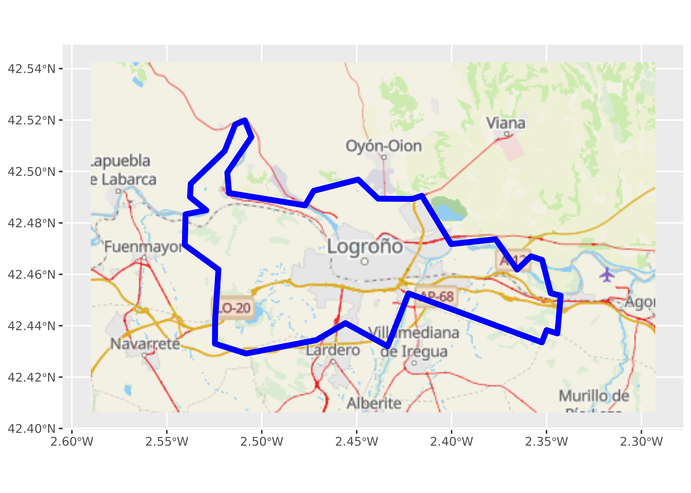
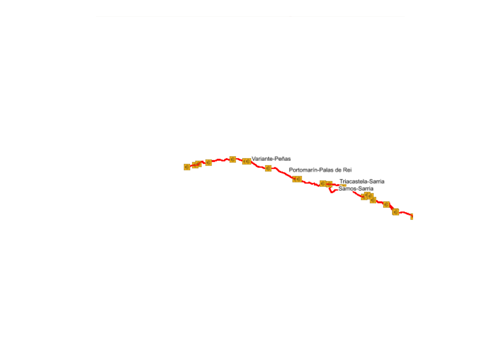
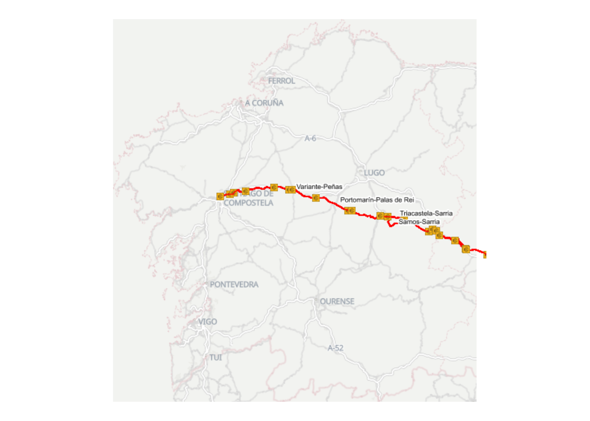
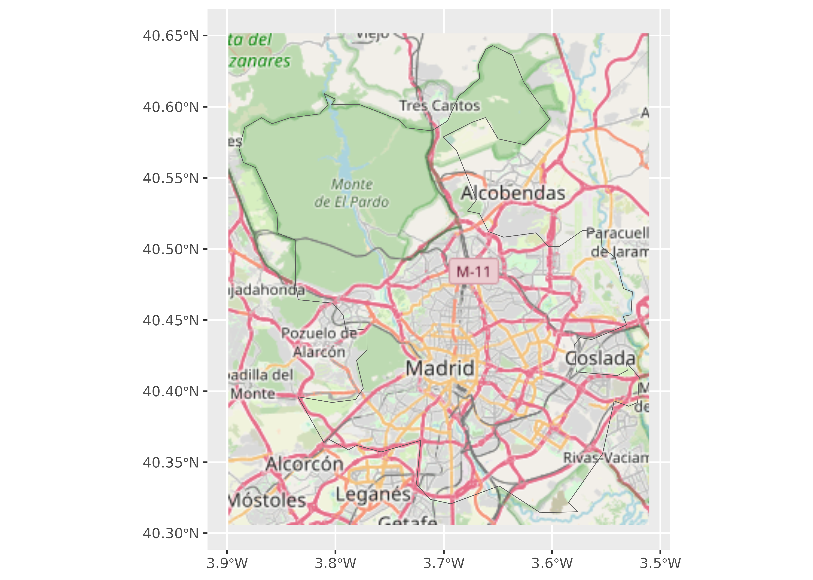
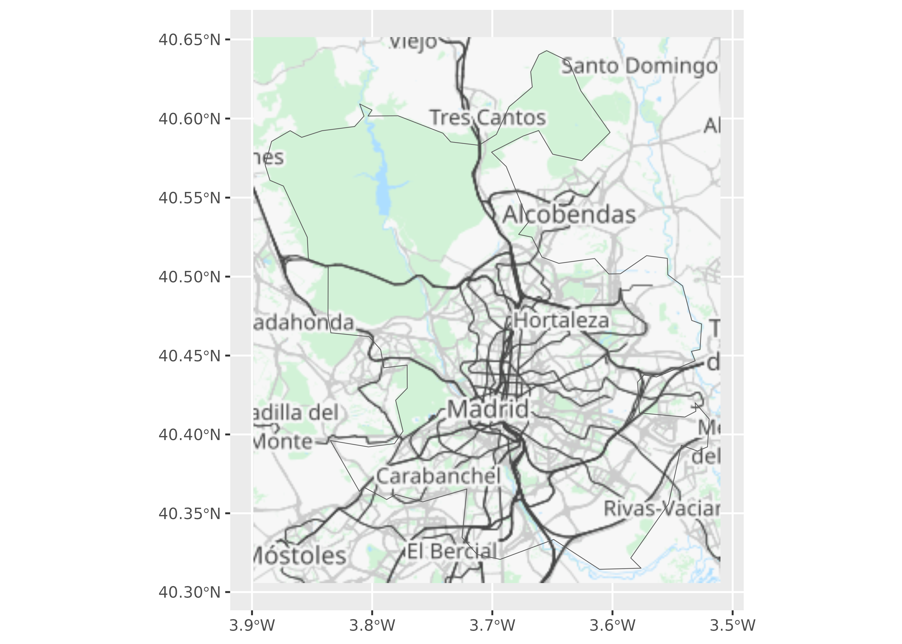

# Working with imagery

**mapSpain** provides a powerful interface for working with imagery. It
can download static files as `.png` or `.jpeg` (depending on the Web Map
Service) and use them alongside your shapefiles.

**mapSpain** also provides a plugin for the **R**
[Leaflet](https://rstudio.github.io/leaflet/) package, which allows
adding multiple basemaps to interactive maps.

The services are implemented via the Leaflet plugin
[leaflet-providersESP](https://dieghernan.github.io/leaflet-providersESP/).
You can view each provider option at that link.

## Static tiles

An example showing how to include multiple tiles to create a static map.
We focus on layers provided by La Rioja’s [Infraestructura de Datos
Espaciales (IDERioja)](https://www.iderioja.larioja.org/).

- **When working with imagery, set `moveCAN = FALSE`; otherwise images
  for the Canary Islands may be inaccurate.**

``` r
library(mapSpain)
library(sf)
library(ggplot2)
library(tidyterra)

# Logroño
lgn_borders <- esp_get_munic_siane(munic = "Logroño")

# Convert to Mercator (EPSG:3857) as a general advice when working with tiles
lgn_borders <- st_transform(lgn_borders, 3857)

tile_lgn <- esp_get_tiles(lgn_borders, "IDErioja", bbox_expand = 0.5)

ggplot(lgn_borders) +
  geom_spatraster_rgb(data = tile_lgn) +
  geom_sf(fill = NA, linewidth = 2, color = "blue")
```



Figure 1: Map of the limits of city of Logroño using a tile as a basemap

### Alpha value on tiles

Some tiles can be loaded with or without an alpha (transparency) value,
which controls layer transparency:

``` r
galicia <- esp_get_ccaa("Galicia", epsg = 3857)

# Example without transparency
basemap <- esp_get_tiles(
  galicia,
  "IDErioja.Claro",
  zoommin = 1,
  crop = TRUE,
  bbox_expand = 0
)
tile_opaque <- esp_get_tiles(
  galicia,
  "CaminoDeSantiago",
  verbose = TRUE,
  transparent = FALSE,
  crop = TRUE,
  bbox_expand = 0
)

ggplot() +
  geom_spatraster_rgb(data = basemap) +
  geom_spatraster_rgb(data = tile_opaque) +
  theme_void()
```



Figure 2: Map of the Way of St. James in Galicia

Now let’s check the same code using the `transparent = TRUE` option:

``` r
# Example with transparency
tile_alpha <- esp_get_tiles(
  galicia,
  "CaminoDeSantiago",
  transparent = TRUE,
  crop = TRUE,
  bbox_expand = 0
)

# Same code than above for plotting
ggplot() +
  geom_spatraster_rgb(data = basemap) +
  geom_spatraster_rgb(data = tile_alpha) +
  theme_void()
```



Figure 3: Example on how to use alpha value for combining different
types of basemaps.

Now the two tiles overlap with the desired transparency.

### Masking tiles

Another useful feature is the ability to mask tiles, allowing more
advanced maps to be plotted:

``` r
rioja <- esp_get_prov("La Rioja", epsg = 3857)

basemap <- esp_get_tiles(rioja, "PNOA", bbox_expand = 0.1, zoommin = 1)

masked <- esp_get_tiles(rioja, "IDErioja", mask = TRUE, zoommin = 1)

ggplot() +
  geom_spatraster_rgb(data = basemap, maxcell = 10e6) +
  geom_spatraster_rgb(data = masked, maxcell = 10e6)
```


Figure 4: Example of combining types of tiles by masking to a shapefile.

## Custom providers

You can use
[`esp_get_tiles()`](https://ropenspain.github.io/mapSpain/dev/reference/esp_get_tiles.md)
to get tiles of any other provider, for example OpenStreetMap:

``` r
osm_spec <- list(
  id = "OSM",
  q = "https://tile.openstreetmap.org/{z}/{x}/{y}.png"
)

madrid_city <- esp_get_munic_siane(munic = "^Madrid$", epsg = 3857)
madrid_osm <- esp_get_tiles(madrid_city, type = osm_spec, zoommin = 1)

ggplot() +
  geom_spatraster_rgb(data = madrid_osm) +
  geom_sf(data = madrid_city, fill = NA)
```



Figure 5: Example of base map using OpenStreetMap

Another example using a provider that needs an API Key (ThunderForest):

``` r
# Skip if not API KEY
apikey <- Sys.getenv("THUNDERFOREST_API_KEY", "")
if (apikey != "") {
  thunder_spec <- list(
    id = "ThunderForest",
    q = paste0(
      "https://tile.thunderforest.com/transport/{z}/{x}/{y}.png?apikey=",
      apikey
    )
  )
  madrid_thunder <- esp_get_tiles(madrid_city, type = thunder_spec, zoommin = 1)

  ggplot() +
    geom_spatraster_rgb(data = madrid_thunder) +
    geom_sf(data = madrid_city, fill = NA)
}
```



Example of base map using ThunderForest

## Dynamic maps with Leaflet

**mapSpain** provides a plugin for the **Leaflet** package. Below are
some quick examples:

### Earthquakes in Tenerife (last year)

``` r
library(leaflet)

tenerife_leaf <- esp_get_nuts(
  region = "Tenerife",
  epsg = 4326,
  moveCAN = FALSE
)

bbox <- as.double(round(st_bbox(tenerife_leaf) + c(-1, -1, 1, 1), 2))

# Start leaflet
m <- leaflet(
  tenerife_leaf,
  elementId = "tenerife-earthquakes",
  width = "100%",
  height = "60vh",
  options = leafletOptions(minZoom = 9, maxZoom = 18)
)

# Add layers
m <- m |>
  addProviderEspTiles("IDErioja.Relieve") |>
  addPolygons(color = NA, fillColor = "red", group = "Polygon") |>
  addProviderEspTiles("Geofisica.Terremotos365dias", group = "Earthquakes")

# Add additional options
m |>
  addLayersControl(
    overlayGroups = c("Polygon", "Earthquakes"),
    options = layersControlOptions(collapsed = FALSE)
  ) |>
  setMaxBounds(bbox[1], bbox[2], bbox[3], bbox[4])
```

### Population density in Spain

A map showing the population density of Spain as of 2019:

``` r
library(leaflet)
library(dplyr)
munic <- esp_get_munic_siane(
  year = "2025-01-01",
  epsg = 4326,
  moveCAN = FALSE,
  rawcols = TRUE
) |>
  # Get area in km2 from siane munic
  # Already on the shapefile
  mutate(area_km2 = st_area_sh * 10000)

# Get population
pop <- mapSpain::pobmun25 |>
  select(-name)

# Paste
munic_pop <- munic |>
  left_join(pop) |>
  mutate(
    dens = pob25 / area_km2,
    dens_label = prettyNum(round(dens, 2), big.mark = ".", decimal.mark = ",")
  )

# Create leaflet
bins <- c(0, 10, 25, 100, 200, 500, 1000, 5000, 10000, Inf)

pal <- colorBin("inferno", domain = munic_pop$dens, bins = bins, reverse = TRUE)

labels <- sprintf(
  "<strong>%s</strong><br/><em>%s</em><br/>%s pers. / km<sup>2</sup>",
  munic_pop$rotulo,
  munic_pop$ine.prov.name,
  munic_pop$dens_label
) |>
  lapply(htmltools::HTML)

leaflet(elementId = "SpainDemo", width = "100%", height = "60vh") |>
  setView(lng = -3.684444, lat = 40.308611, zoom = 5) |>
  addProviderEspTiles("IDErioja") |>
  addPolygons(
    data = munic_pop,
    fillColor = ~ pal(dens),
    fillOpacity = 0.6,
    color = "#44444",
    weight = 0.5,
    smoothFactor = .1,
    opacity = 1,
    highlightOptions = highlightOptions(
      color = "white",
      weight = 1,
      bringToFront = TRUE
    ),
    popup = labels
  ) |>
  addLegend(
    pal = pal,
    values = bins,
    opacity = 0.7,
    title = paste0(
      "<small>Pop. Density km<sup>2</sup></small><br><small>",
      "(2025)</small>"
    ),
    position = "bottomright"
  )
```

## Available providers

The `esp_tiles_providers` list contains metadata for the tile providers
available to the functions above. It includes all arguments required to
reproduce the API request. Below is the static URL for each provider:
