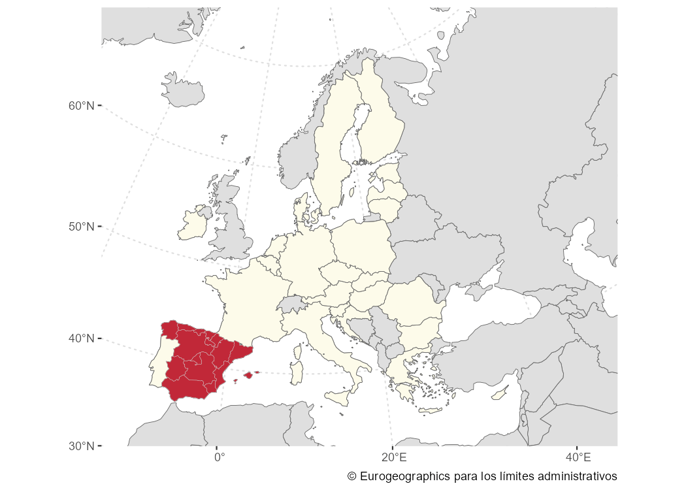

# mapSpain

[**mapSpain**](https://ropenspain.github.io/mapSpain/) is a package that
provides **sf** objects of Spain’s administrative boundaries, including
Autonomous Communities, provinces and municipalities.

**mapSpain** also provides a plugin for the [**leaflet**
package](https://rstudio.github.io/leaflet/). It loads several basemaps
from Spain’s public institutions and enables downloading and processing
static tiles.

The full package website, with examples and vignettes, is available at
<https://ropenspain.github.io/mapSpain/>.

## Installation

Install **mapSpain** from
[**CRAN**](https://CRAN.R-project.org/package=mapSpain):

``` r

install.packages("mapSpain", dependencies = TRUE)
```

## Usage

The following examples highlight some key features of **mapSpain**.

``` r

library(mapSpain)
library(sf)
library(dplyr)
census <- mapSpain::pobmun25 |>
  select(-name)

# Extract CCAA from the base dataset.
codelist <- mapSpain::esp_codelist |>
  select(cpro, codauto) |>
  distinct()

census_ccaa <- census |>
  left_join(codelist) |>
  # Summarize by CCAA.
  group_by(codauto) |>
  summarise(pob25 = sum(pob25), men = sum(men), women = sum(women)) |>
  mutate(
    porc_women = women / pob25,
    porc_women_lab = paste0(round(100 * porc_women, 2), "%")
  )

# Merge into spatial data.
ccaa_sf <- esp_get_ccaa() |>
  left_join(census_ccaa)

can <- esp_get_can_box()

# Plot with ggplot.
library(ggplot2)

ggplot(ccaa_sf) +
  geom_sf(aes(fill = porc_women), color = "grey70", linewidth = 0.3) +
  geom_sf(data = can, color = "grey70") +
  geom_sf_label(
    aes(label = porc_women_lab),
    fill = "white",
    alpha = 0.5,
    size = 3,
    linewidth = 0
  ) +
  scale_fill_gradientn(
    colors = hcl.colors(10, "Blues", rev = TRUE),
    n.breaks = 10,
    labels = scales::label_percent(),
    guide = guide_legend(title = "% women", position = "inside")
  ) +
  theme_void() +
  theme(legend.position.inside = c(0.1, 0.6)) +
  labs(caption = "Source: CartoBase ANE 2006-2024 CC-BY 4.0 ign.es, INE")
```


You can combine `sf` objects with static tiles.

``` r

# Get census data.
census <- mapSpain::pobmun25 |>
  mutate(porc_women = women / pob25) |>
  select(cpro, cmun, porc_women)

# Get geometries.
shape <- esp_get_munic_siane(region = "Segovia", epsg = 3857)
provs <- esp_get_prov_siane(epsg = 3857)

shape_pop <- shape |> left_join(census)

tile <- esp_get_tiles(shape_pop, type = "IDErioja.Relieve", zoommin = 1)

# Plot

library(ggplot2)
library(tidyterra)

lims <- as.vector(terra::ext(tile))

ggplot(remove_missing(shape_pop, na.rm = TRUE)) +
  geom_spatraster_rgb(data = tile, maxcell = 10e6) +
  geom_sf(aes(fill = porc_women), color = NA) +
  geom_sf(data = provs, fill = NA) +
  scale_fill_gradientn(
    colours = hcl.colors(10, "RdYlBu", alpha = 0.5),
    n.breaks = 8,
    labels = function(x) {
      sprintf("%1.0f%%", 100 * x)
    },
    guide = guide_legend(title = "", )
  ) +
  coord_sf(
    xlim = lims[c(1, 2)],
    ylim = lims[c(3, 4)],
    expand = FALSE
  ) +
  labs(
    title = "% women in Segovia by town (2025)",
    caption = paste0(
      "Source: INE, CC BY 4.0 www.iderioja.org, ",
      "CartoBase ANE 2006-2024 CC-BY 4.0 ign.es"
    )
  ) +
  theme_void() +
  theme(
    title = element_text(face = "bold")
  )
```


## mapSpain and giscoR

If you need to plot Spain alongside other countries, consider using the
[**giscoR**](https://ropengov.github.io/giscoR/) package, which is
installed as a dependency with **mapSpain**. Here is a basic example:

``` r

library(giscoR)

# Set the same resolution for a perfect fit.

res <- "20"

all_countries <- gisco_get_countries(resolution = res) |>
  st_transform(3035)

eu_countries <- gisco_get_countries(resolution = res, region = "EU") |>
  st_transform(3035)

ccaa <- esp_get_ccaa(moveCAN = FALSE, resolution = res) |>
  st_transform(3035)

library(ggplot2)

ggplot(all_countries) +
  geom_sf(fill = "#DFDFDF", color = "#656565") +
  geom_sf(data = eu_countries, fill = "#FDFBEA", color = "#656565") +
  geom_sf(data = ccaa, fill = "#C12838", color = "grey80", linewidth = 0.1) +
  # Center in Europe: EPSG 3035
  coord_sf(xlim = c(2377294, 7453440), ylim = c(1313597, 5628510)) +
  theme(
    panel.background = element_blank(),
    panel.grid = element_line(colour = "#DFDFDF", linetype = "dotted")
  ) +
  labs(caption = giscoR::gisco_attributions("es"))
```



## A note on caching

Some datasets and tiles may be larger than 50 MB. You can use
**mapSpain** to create your own local repository in a given local
directory by setting the following option:

``` r

esp_set_cache_dir("./path/to/location")
```

When this option is set, **mapSpain** looks for the cached file and
loads it, which speeds up subsequent calls.

## Citation

Hernangómez D (2026). *mapSpain: Administrative Boundaries of Spain*.
[doi:10.5281/zenodo.5366622](https://doi.org/10.5281/zenodo.5366622).
<https://ropenspain.github.io/mapSpain/>.

A BibTeX entry for LaTeX users is:

``` R
@Manual{R-mapspain,
  title = {{mapSpain}: Administrative Boundaries of Spain},
  year = {2026},
  version = {1.1.0},
  author = {Diego Hernangómez},
  doi = {10.5281/zenodo.5366622},
  url = {https://ropenspain.github.io/mapSpain/},
  abstract = {Administrative boundaries of Spain at several levels (Autonomous Communities, provinces and municipalities), based on GISCO from Eurostat <https://ec.europa.eu/eurostat/web/gisco> and CartoBase ANE from Instituto Geográfico Nacional <https://www.ign.es/>. It also provides a plugin for leaflet and tools to download and process static map tiles.},
}
```

## Contribute

Check the GitHub page for the [source
code](https://github.com/ropenspain/mapSpain/).

## Copyright notice

This package uses data from CartoBase SIANE, provided by Instituto
Geográfico Nacional.

> Atlas Nacional de España (ANE) [CC BY
> 4.0](https://creativecommons.org/licenses/by/4.0/deed.en)
> [ign.es](https://www.ign.es/)

See <https://github.com/rOpenSpain/mapSpain/tree/sianedata>

This package also uses data from GISCO. GISCO
[(FAQ)](https://ec.europa.eu/eurostat/web/gisco) is a geospatial open
data repository with multiple datasets at various resolution levels.

*From GISCO \> Geodata \> Reference data \> Administrative Units /
Statistical Units*

> When data downloaded from this page is used in any printed or
> electronic publication, in addition to any other provisions applicable
> to the whole Eurostat website, data source will have to be
> acknowledged in the legend of the map and in the introductory page of
> the publication with the following copyright notice:
>
> EN: © EuroGeographics for the administrative boundaries
>
> FR: © EuroGeographics pour les limites administratives
>
> DE: © EuroGeographics bezüglich der Verwaltungsgrenzen
>
> For publications in languages other than English, French or German,
> the translation of the copyright notice in the language of the
> publication shall be used.

If you intend to use the data commercially, please contact
EuroGeographics for information regarding their license agreements.
