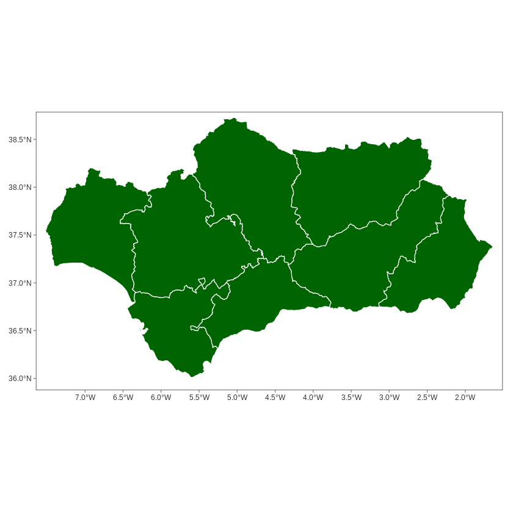
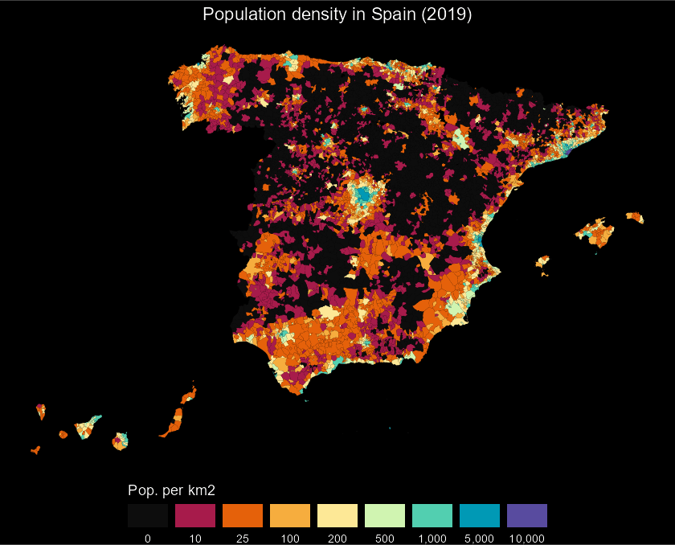

## Introduction

**Full site with more examples and vignettes on
<https://ropenspain.github.io/mapSpain/>**

[**mapSpain**](https://ropenspain.github.io/mapSpain/) is a package designed to
provide geographical information of Spain at different levels.

**mapSpain** provides shapefiles of municipalities, provinces, autonomous
communities and NUTS levels of Spain. It also provides hexbin shapefiles and
other complementary shapes, as the usual lines around the Canary Islands.

**mapSpain** provides access to map tiles of public organisms of Spain, that can
be represented on static maps via `mapSpain::esp_getTiles()` or on a **R**
`leaflet` map using `mapSpain::addProviderEspTiles()`.

On top of that, **mapSpain** also has a powerful dictionary that translate
provinces and other regions to English, Spanish, Catalan, Basque language or
Galician, and also converts those names to different coding standards, as NUTS,
ISO2 or the coding system used by the INE, that is the official statistic agency
of Spain.

## Caching

**mapSpain** provides a dataset and tile caching capability, that could be set
as:


```r

esp_set_cache_dir("./path/to/location")
```

**mapSpain** relies on [**giscoR**](https://ropengov.github.io/giscoR/) for
downloading some files, and both packages are well synchronized. Setting the
same caching directory on both would speed up the data load on your session.

## Basic example

Some examples of what **mapSpain** can do:


```r

library(mapSpain)
library(ggplot2)

country <- esp_get_country()
lines <- esp_get_can_box()

ggplot(country) +
  geom_sf(fill = "cornsilk", color = "#887e6a") +
  labs(title = "Map of Spain") +
  theme(
    panel.background = element_rect(fill = "#fffff3"),
    panel.border = element_rect(
      colour = "#887e6a",
      fill = NA,
    ),
    text = element_text(
      family = "serif",
      face = "bold"
    )
  )
```


```r

# Plot provinces

Andalucia <- esp_get_prov("Andalucia")

ggplot(Andalucia) +
  geom_sf(fill = "darkgreen", color = "white") +
  theme_bw()
```



```r


# Plot municipalities

Euskadi_CCAA <- esp_get_ccaa("Euskadi")
Euskadi <- esp_get_munic(region = "Euskadi")

# Use dictionary

Euskadi$name_eu <- esp_dict_translate(Euskadi$ine.prov.name, lang = "eu")

ggplot(Euskadi_CCAA) +
  geom_sf(fill = "grey50") +
  geom_sf(data = Euskadi, aes(fill = name_eu)) +
  scale_fill_manual(values = c("red2", "darkgreen", "ivory2")) +
  labs(
    fill = "",
    title = "Euskal Autonomia Erkidegoko",
    subtitle = "Probintziak"
  ) +
  theme_void() +
  theme(
    plot.title = element_text(face = "bold"),
    plot.subtitle = element_text(face = "italic")
  )
```


## Choropleth and label maps

Let's analyze the distribution of women in each autonomous community with
`ggplot`:


```r

census <- mapSpain::pobmun19

# Extract CCAA from base dataset

codelist <- mapSpain::esp_codelist

census <-
  unique(merge(census, codelist[, c("cpro", "codauto")], all.x = TRUE))

# Summarize by CCAA
census_ccaa <-
  aggregate(cbind(pob19, men, women) ~ codauto, data = census, sum)

census_ccaa$porc_women <- census_ccaa$women / census_ccaa$pob19
census_ccaa$porc_women_lab <-
  paste0(round(100 * census_ccaa$porc_women, 2), "%")

# Merge into spatial data

CCAA_sf <- esp_get_ccaa()
CCAA_sf <- merge(CCAA_sf, census_ccaa)
Can <- esp_get_can_box()

ggplot(CCAA_sf) +
  geom_sf(aes(fill = porc_women),
    color = "grey70",
    linewidth = .3
  ) +
  geom_sf(data = Can, color = "grey70") +
  geom_sf_label(aes(label = porc_women_lab),
    fill = "white", alpha = 0.5,
    size = 3,
    label.size = 0
  ) +
  scale_fill_gradientn(
    colors = hcl.colors(10, "Blues", rev = TRUE),
    n.breaks = 10,
    labels = function(x) {
      sprintf("%1.1f%%", 100 * x)
    },
    guide = guide_legend(title = "Porc. women")
  ) +
  theme_void() +
  theme(legend.position = c(0.1, 0.6))
```


## Thematic maps

This is an example on how **mapSpain** can be used to beautiful thematic maps.
For plotting purposes we would use the
[**ggplot**](https://ggplot2.tidyverse.org/) package, however any package that
handles `sf` objects (e.g. **tmap**, **mapsf**, **leaflet**, etc. could be
used).


```r

# Population density of Spain

library(sf)

pop <- mapSpain::pobmun19
munic <- esp_get_munic()

# Get area (km2) - Use LAEA projection
municarea <- as.double(st_area(st_transform(munic, 3035)) / 1000000)
munic$area <- municarea

munic.pop <- merge(munic, pop, all.x = TRUE, by = c("cpro", "cmun"))
munic.pop$dens <- munic.pop$pob19 / munic.pop$area

br <-
  c(
    -Inf,
    10,
    25,
    100,
    200,
    500,
    1000,
    5000,
    10000,
    Inf
  )


munic.pop$cuts <- cut(munic.pop$dens, br)

ggplot(munic.pop) +
  geom_sf(aes(fill = cuts), color = NA, linewidth = 0) +
  scale_fill_manual(
    values = c("grey5", hcl.colors(
      length(br) - 2,
      "Spectral"
    )),
    labels = prettyNum(c(0, br[-1]), big.mark = ","),
    guide = guide_legend(
      title = "Pop. per km2",
      direction = "horizontal",
      nrow = 1,
      keywidth = 2,
      title.position = "top",
      label.position = "bottom"
    )
  ) +
  labs(title = "Population density in Spain (2019)") +
  theme_void() +
  theme(
    plot.title = element_text(hjust = .5),
    plot.background = element_rect(fill = "black"),
    text = element_text(colour = "white"),
    legend.position = "bottom"
  )
```



## mapSpain and giscoR

If you need to plot Spain along with another countries, consider using
[**giscoR**](https://ropengov.github.io/giscoR/) package, that is installed as a
dependency when you installed **mapSpain**. A basic example:


```r

library(giscoR)

# Set the same resolution for a perfect fit

res <- "03"

# Same crs
target_crs <- 3035

all_countries <- gisco_get_countries(
  resolution = res,
  epsg = target_crs
)
eu_countries <- gisco_get_countries(
  resolution = res, region = "EU",
  epsg = target_crs
)
ccaa <- esp_get_ccaa(
  moveCAN = FALSE, resolution = res,
  epsg = target_crs
)

ggplot(all_countries) +
  geom_sf(fill = "#DFDFDF", color = "#656565") +
  geom_sf(data = eu_countries, fill = "#FDFBEA", color = "#656565") +
  geom_sf(data = ccaa, fill = "#C12838", color = "grey80", linewidth = .1) +
  # Center in Europe: EPSG 3035
  coord_sf(
    xlim = c(2377294, 7453440),
    ylim = c(1313597, 5628510)
  ) +
  theme(
    panel.background = element_blank(),
    panel.grid = element_line(
      colour = "#DFDFDF",
      linetype = "dotted"
    )
  )
```


## Working with tiles

**mapSpain** provides a powerful interface for working with imagery.
**mapSpain** can download static files as `.png` or`jpeg` files (depending on
the Web Map Service) and use them along your shapefiles.

**mapSpain** also includes a plugin for **R**
[leaflet](https://rstudio.github.io/leaflet/) package, that allows you to
include several basemaps on your interactive maps.

The services are implemented via the leaflet plugin
[leaflet-providersESP](https://dieghernan.github.io/leaflet-providersESP/). You
can check a display of each provider on the previous link.

**Note that** When working with imagery, it is important to set
`moveCAN = FALSE` on the `esp_get_*` functions. See **Displacing the Canary
Islands** on `help("esp_get_ccaa", package = "mapSpain")`.
