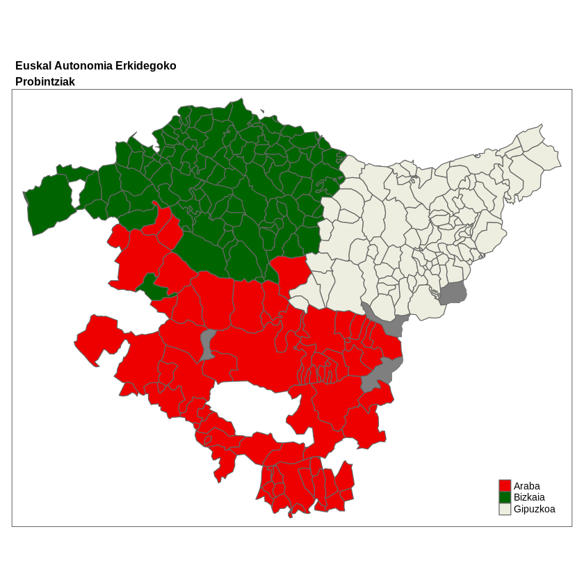

## Introduction

**Full site with more examples and vignettes on
<https://ropenspain.github.io/mapSpain/>**

[**`mapSpain`**](https://ropenspain.github.io/mapSpain/) is a package designed
to provide geographical information of Spain at different levels.

**`mapSpain`** provides shapefiles of municipalities, provinces, autonomous
communities and NUTS levels of Spain. It also provides hexbin shapefiles and
other complementary shapes, as the usual lines around the Canary Islands.

**`mapSpain`** provides access to map tiles of public organisms of Spain, that
can be represented on static maps via `mapSpain::esp_getTiles()` or on a **R**
leaflet map using `mapSpain::addProviderEspTiles()`.

On top of that, **`mapSpain`** also has a powerful dictionary that translate
provinces and other regions to English, Spanish, Catalan, Basque language or
Galician, and also converts those names to different coding standards, as NUTS,
ISO2 or the coding system used by the INE, that is the official statistic agency
of Spain.

## Caching

`mapSpain` provides a dataset and tile caching capability, that could be set as:


```r
options(mapSpain_cache_dir = "~/path/to/dir")

# OR

options(gisco_cache_dir = "~/path/to/dir")
```

`mapSpain` relies on [`giscoR`](https://dieghernan.github.io/giscoR/) for
downloading some files, and both packages are well synchronized, so if you
already use `giscoR` and you have set your caching options for that package it
would be recognized too by `mapSpain`.


## Basic example

Some examples of what `mapSpain` can do:


```r

library(mapSpain)
library(tmap)

country <- esp_get_country()
lines <- esp_get_can_box()

tm_shape(country) +
  tm_polygons() +
  tm_shape(lines) +
  tm_lines() +
  tm_graticules(lines = FALSE) +
  tm_style("classic") +
  tm_layout(main.title = "Map of Spain")
```


```r

# Plot provinces

Andalucia <- esp_get_prov("Andalucia")

tm_shape(Andalucia) +
  tm_polygons(col = "darkgreen", border.col = "white") +
  tm_graticules(lines = FALSE)
```


```r

# Plot municipalities

Euskadi_CCAA <- esp_get_ccaa("Euskadi")
Euskadi <- esp_get_munic(region = "Euskadi")

# Use dictionary

Euskadi$name_eu <- esp_dict_translate(Euskadi$ine.prov.name, lang = "eu")

tm_shape(Euskadi_CCAA) +
  tm_fill("grey50") +
  tm_shape(Euskadi) +
  tm_polygons("name_eu",
    palette = c("red2", "darkgreen", "ivory2"),
    title = ""
  ) +
  tm_layout(
    main.title = paste0(
      "Euskal Autonomia Erkidegoko",
      "\n",
      "Probintziak"
    ),
    main.title.size = 0.8,
    main.title.fontface = "bold"
  )
```



## Choropleth and label maps

Let's analyze the distribution of women in each autonomous community with
`tmap`:


```r

census <- mapSpain::pobmun19

# Extract CCAA from base dataset

codelist <- mapSpain::esp_codelist

census <-
  unique(merge(census, codelist[, c("cpro", "codauto")], all.x = TRUE))

# Summarize by CCAA
census_ccaa <-
  aggregate(cbind(pob19, men, women) ~ codauto, data = census, sum)

census_ccaa$porc_women <- census_ccaa$women / census_ccaa$pob19
census_ccaa$porc_women_lab <-
  paste0(round(100 * census_ccaa$porc_women, 2), "%")

# Merge into spatial data

CCAA_sf <- esp_get_ccaa()
CCAA_sf <- merge(CCAA_sf, census_ccaa)
Can <- esp_get_can_box()


# Plot with tmap
tm_shape(CCAA_sf) +
  tm_polygons(
    "porc_women",
    border.col = "grey70",
    title = "Porc. women",
    palette = "Blues",
    alpha = 0.7,
    legend.format = list(
      fun = function(x) {
        sprintf("%1.1f%%", 100 * x)
      }
    )
  ) +
  tm_shape(CCAA_sf, point.per = "feature") +
  tm_text("porc_women_lab", auto.placement = TRUE) +
  tm_shape(Can) +
  tm_lines(col = "grey70") +
  tm_layout(legend.position = c("LEFT", "center"))
```


## Thematic maps

This is an example on how `mapSpain` can be used to beautiful thematic maps. For
plotting purposes we would use the [`tmap`](https://mtennekes.github.io/tmap/)
package, however any package that handles `sf` objects (e.g. `ggplot2`, `mapsf`,
`leaflet`, etc. could be used).


```r

# Population density of Spain

library(sf)

pop <- mapSpain::pobmun19
munic <- esp_get_munic()

# Get area (km2) - Use LAEA projection
municarea <- as.double(st_area(st_transform(munic, 3035)) / 1000000)
munic$area <- municarea

munic.pop <- merge(munic, pop, all.x = TRUE, by = c("cpro", "cmun"))
munic.pop$dens <- munic.pop$pob19 / munic.pop$area

br <-
  c(
    0,
    10,
    25,
    100,
    200,
    500,
    1000,
    5000,
    10000,
    Inf
  )


tm_shape(munic.pop) +
  tm_fill("dens",
    breaks = br,
    alpha = 0.8,
    title = "Pop. per km2",
    palette = "inferno",
    showNA = FALSE,
    colorNA = "#000004"
  ) +
  tm_layout(
    main.title = "Population Density in Spain (2019)",
    main.title.size = 0.8,
    frame = FALSE,
    bg.color = "#000004",
    legend.outside = TRUE,
    legend.text.color = "white",
    legend.title.color = "white",
    main.title.color = "white",
    main.title.fontface = "bold",
    legend.text.fontface = "bold",
    legend.title.fontface = "bold"
  )
```


## mapSpain and giscoR

If you need to plot Spain along with another countries, consider using
[`giscoR`](https://dieghernan.github.io/giscoR/) package, that is installed
as a dependency when you installed `mapSpain`. A basic example:


```r

library(giscoR)

# Set the same resolution for a perfect fit

res <- "01"

all_countries <- gisco_get_countries(resolution = res)
eu_countries <- gisco_get_countries(resolution = res, region = "EU")
ccaa <- esp_get_ccaa(moveCAN = FALSE, resolution = res)

# Project to same CRS

all_countries <- st_transform(all_countries, 3035)
eu_countries <- st_transform(eu_countries, 3035)
ccaa <- st_transform(ccaa, 3035)

# Plot

tm_shape(all_countries, bbox = c(23, 14, 67, 54) * 10e4) +
  tm_graticules(col = "#DFDFDF", alpha = 0.7) +
  tm_fill("#DFDFDF") +
  tm_shape(eu_countries) +
  tm_polygons("#FDFBEA", border.col = "#656565") +
  tm_shape(ccaa) +
  tm_polygons("#C12838", border.col = "white")
```


