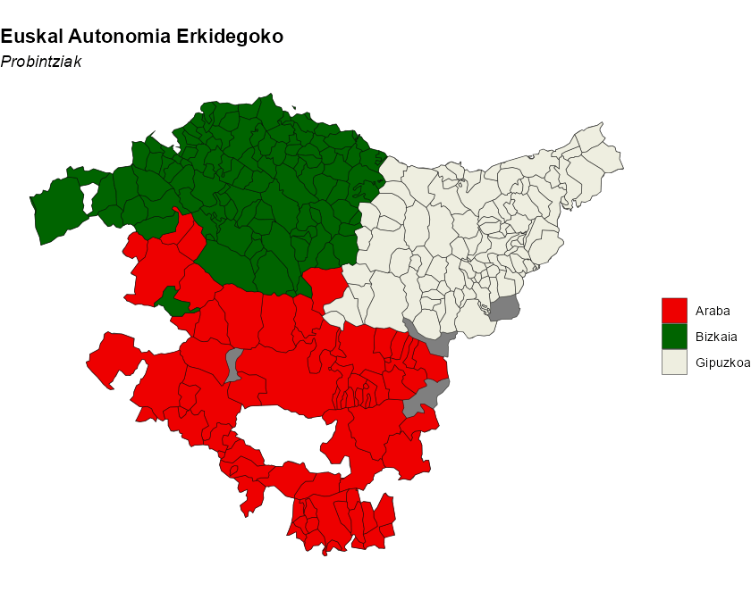

<!-- mapSpain.Rmd is generated from mapSpain.Rmd.orig. Please edit that file -->


## Introduction

**Full site with more examples and vignettes on
<https://ropenspain.github.io/mapSpain/>**

[**mapSpain**](https://ropenspain.github.io/mapSpain/) is a package designed to
provide geographical information of Spain at different levels.

**mapSpain** provides shapefiles of municipalities, provinces, autonomous
communities, and NUTS levels of Spain. It also provides hexbin shapefiles and
other complementary shapes, such as the demarcation lines around the Canary
Islands.

**mapSpain** provides access to map tiles from Spain's public institutions,
which can be represented on static maps via `mapSpain::esp_get_tiles()` or on an
**R** **Leaflet** map using `mapSpain::addProviderEspTiles()`.

Additionally, **mapSpain** includes a powerful dictionary that translates
province and region names to English, Spanish, Catalan, Basque, and Galician,
and converts them to various coding standards such as NUTS, ISO2, and the INE
(the official Spanish statistical agency) coding system.

## Caching

**mapSpain** provides dataset and tile caching capabilities, which can be set
as:


``` r
esp_set_cache_dir("./path/to/location")
```

**mapSpain** relies on [**giscoR**](https://ropengov.github.io/giscoR/) for
downloading certain files, and both packages are well synchronized. Setting the
same caching directory for both packages will speed up data loading in your
session.

## Basic example

Some examples of what **mapSpain** can do:


``` r
library(mapSpain)
library(ggplot2)

country <- esp_get_spain()
lines <- esp_get_can_box()

ggplot(country) +
  geom_sf(fill = "cornsilk", color = "#887e6a") +
  labs(title = "Map of Spain") +
  theme(
    panel.background = element_rect(fill = "#fffff3"),
    panel.border = element_rect(
      colour = "#887e6a",
      fill = NA,
    ),
    text = element_text(
      family = "serif",
      face = "bold"
    )
  )
```

<div class="figure">

<p class="caption">Example: Map of Spain</p>
</div>


``` r
# Plot provinces

andalucia <- esp_get_prov("Andalucia")

ggplot(andalucia) +
  geom_sf(fill = "darkgreen", color = "white") +
  theme_bw()
```

<div class="figure">

<p class="caption">Example: Provinces of Andalucia</p>
</div>


``` r
# Plot municipalities

euskadi_ccaa <- esp_get_ccaa("Euskadi")
euskadi <- esp_get_munic_siane(region = "Euskadi")

# Use dictionary

euskadi$name_eu <- esp_dict_translate(euskadi$ine.prov.name, lang = "eu")

ggplot(euskadi_ccaa) +
  geom_sf(fill = "grey50") +
  geom_sf(data = euskadi, aes(fill = name_eu)) +
  scale_fill_manual(values = c("red2", "darkgreen", "ivory2")) +
  labs(
    fill = "",
    title = "Euskal Autonomia Erkidegoko",
    subtitle = "Probintziak"
  ) +
  theme_void() +
  theme(
    plot.title = element_text(face = "bold"),
    plot.subtitle = element_text(face = "italic")
  )
```

<div class="figure">

<p class="caption">Example: Municipalities of the Basque Country</p>
</div>

## Choropleth and label maps

Let's analyze the distribution of women in each autonomous community with
**ggplot2**:


``` r
library(dplyr)

census <- mapSpain::pobmun25 |>
  select(-name)

# Extract CCAA from base dataset

codelist <- mapSpain::esp_codelist |>
  select(cpro, codauto) |>
  distinct()

census_ccaa <- census |>
  left_join(codelist) |>
  # Summarize by CCAA
  group_by(codauto) |>
  summarise(pob25 = sum(pob25), men = sum(men), women = sum(women)) |>
  mutate(
    porc_women = women / pob25,
    porc_women_lab = paste0(round(100 * porc_women, 2), "%")
  )


# Merge into spatial data

ccaa_sf <- esp_get_ccaa() |>
  left_join(census_ccaa)
can <- esp_get_can_box()


# Plot with ggplot
library(ggplot2)


ggplot(ccaa_sf) +
  geom_sf(aes(fill = porc_women), color = "grey70", linewidth = .3) +
  geom_sf(data = can, color = "grey70") +
  geom_sf_label(aes(label = porc_women_lab),
    fill = "white", alpha = 0.5,
    size = 3, linewidth = 0
  ) +
  scale_fill_gradientn(
    colors = hcl.colors(10, "Blues", rev = TRUE),
    n.breaks = 10, labels = scales::label_percent(),
    guide = guide_legend(title = "% women", position = "inside")
  ) +
  theme_void() +
  theme(legend.position.inside = c(0.1, 0.6)) +
  labs(caption = "Source: CartoBase ANE 2006-2024 CC-BY 4.0 ign.es, INE")
```

<div class="figure">

<p class="caption">Percentage of women by Autonomous Community (2025)</p>
</div>

## Thematic maps

This example demonstrates how **mapSpain** can be used to create beautiful
thematic maps. For plotting, we use the
[**ggplot2**](https://ggplot2.tidyverse.org/) package, though any package that
handles `sf` objects (e.g., **tmap**, **mapsf**, **leaflet**, etc.) could also
be used.


``` r
# Population density of Spain

library(sf)

pop <- mapSpain::pobmun25 |>
  select(-name)

munic <- esp_get_munic_siane(rawcols = TRUE) |>
  # Get area in km2 from siane munic
  # Already on the shapefile
  mutate(area_km2 = st_area_sh * 10000)


munic_pop <- munic |>
  left_join(pop) |>
  mutate(dens = pob25 / area_km2)


br <- c(-Inf, 10, 25, 100, 200, 500, 1000, 5000, 10000, Inf)

munic_pop$cuts <- cut(munic_pop$dens, br)

ggplot(munic_pop) +
  geom_sf(aes(fill = cuts), color = NA, linewidth = 0) +
  scale_fill_manual(
    values = c("grey5", hcl.colors(length(br) - 2, "Spectral")),
    labels = prettyNum(c(0, br[-1]), big.mark = ","),
    guide = guide_legend(title = "Pop. per km2", direction = "horizontal", nrow = 1)
  ) +
  labs(title = "Population density in Spain (2025)") +
  theme_void() +
  theme(
    plot.title = element_text(hjust = .5),
    plot.background = element_rect(fill = "black"),
    text = element_text(colour = "white"),
    legend.position = "bottom",
    legend.title.position = "top",
    legend.text.position = "bottom",
    legend.key.width = unit(30, "pt")
  ) +
  labs(caption = "Source: CartoBase ANE 2006-2024 CC-BY 4.0 ign.es, INE")
```

<div class="figure">

<p class="caption">Population density in Spain (2025)</p>
</div>

## mapSpain and giscoR

If you need to plot Spain alongside other countries, consider using the
[**giscoR**](https://ropengov.github.io/giscoR/) package, which is installed as
a dependency with **mapSpain**. Here's a basic example:


``` r
library(giscoR)

# Set the same resolution for a perfect fit

res <- "20"

all_countries <- gisco_get_countries(resolution = res) |>
  st_transform(3035)

eu_countries <- gisco_get_countries(
  resolution = res, region = "EU"
) |>
  st_transform(3035)

ccaa <- esp_get_ccaa(
  moveCAN = FALSE, resolution = res
) |>
  st_transform(3035)

# Plot
ggplot(all_countries) +
  geom_sf(fill = "#DFDFDF", color = "#656565") +
  geom_sf(data = eu_countries, fill = "#FDFBEA", color = "#656565") +
  geom_sf(data = ccaa, fill = "#C12838", color = "grey80", linewidth = .1) +
  # Center in Europe: EPSG 3035
  coord_sf(
    xlim = c(2377294, 7453440),
    ylim = c(1313597, 5628510)
  ) +
  theme(
    panel.background = element_blank(),
    panel.grid = element_line(
      colour = "#DFDFDF",
      linetype = "dotted"
    )
  ) +
  labs(caption = giscoR::gisco_attributions("es"))
```

<div class="figure">

<p class="caption">mapSpain and giscoR example</p>
</div>

## Working with tiles

**mapSpain** provides a powerful interface for working with imagery. It can
download static files as `.png` or `.jpeg` files (depending on the Web Map
Service) and use them alongside your shapefiles.

**mapSpain** also includes a plugin for the **R**
[Leaflet](https://rstudio.github.io/leaflet/) package, which allows you to
include several basemaps on your interactive maps.

The services are implemented via the
[leaflet-providersESP](https://dieghernan.github.io/leaflet-providersESP/)
Leaflet plugin. You can view each provider option at that link.

**Note:** When working with imagery, it is important to set `moveCAN = FALSE` in
the `esp_get_*` functions. See **Displacing the Canary Islands** in
`help("esp_move_can", package = "mapSpain")`.
