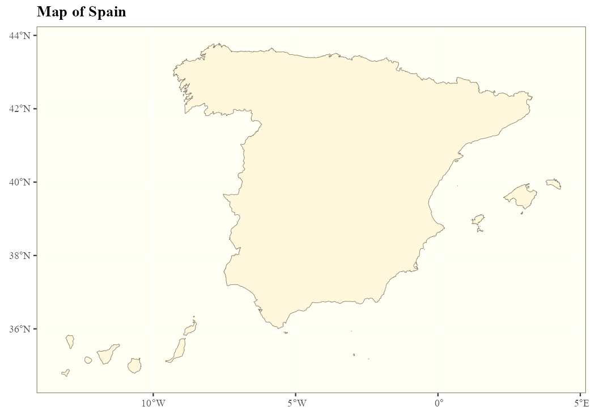
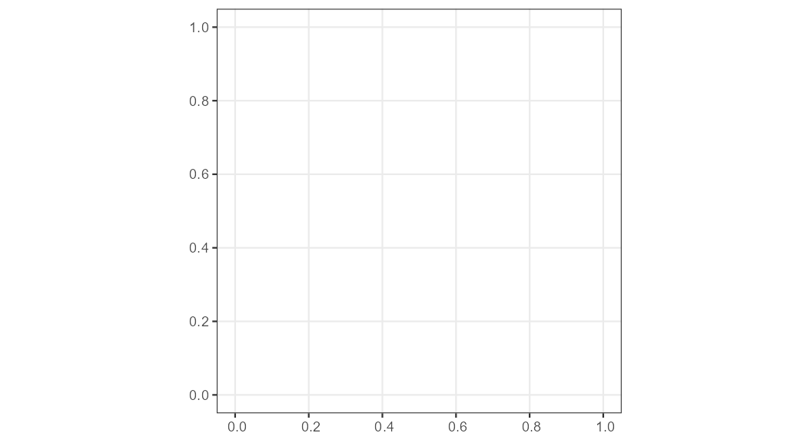
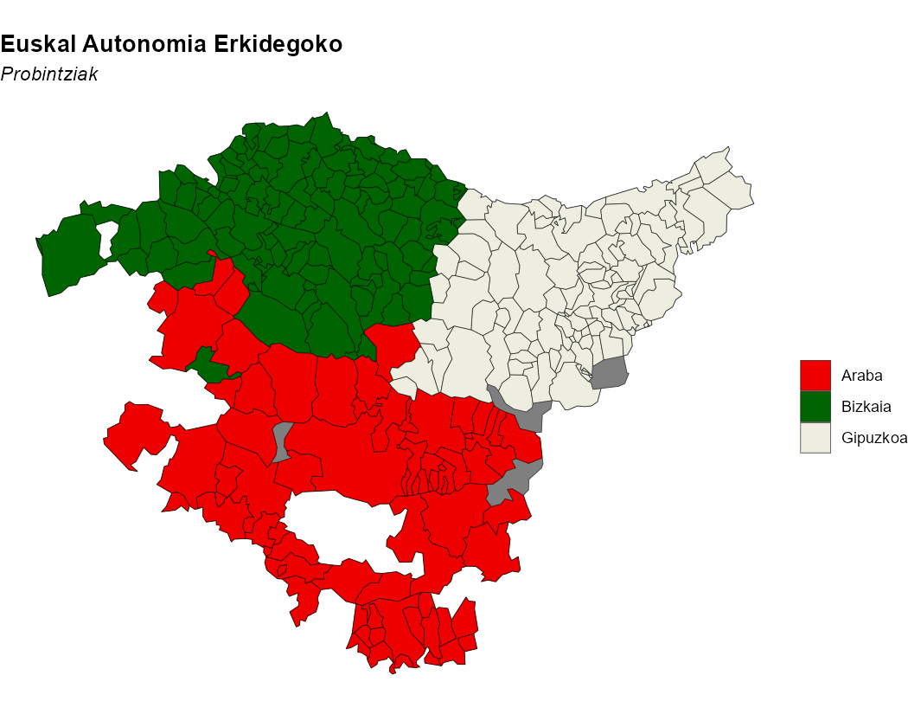
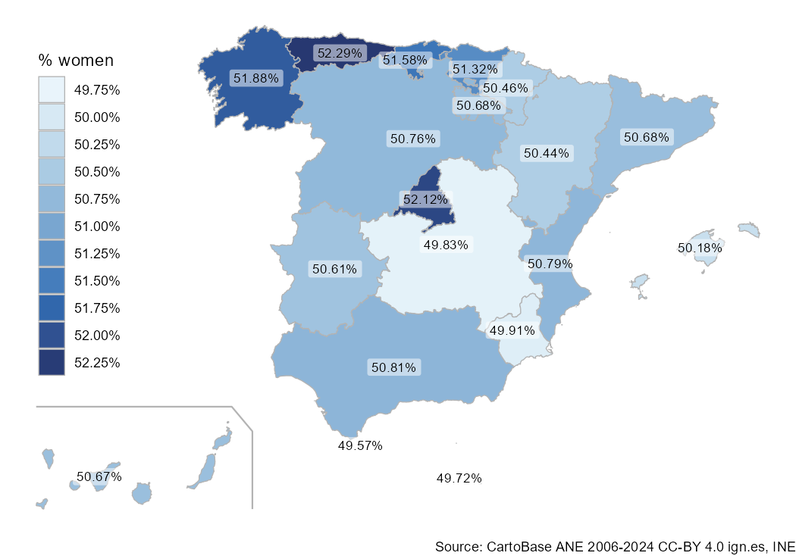
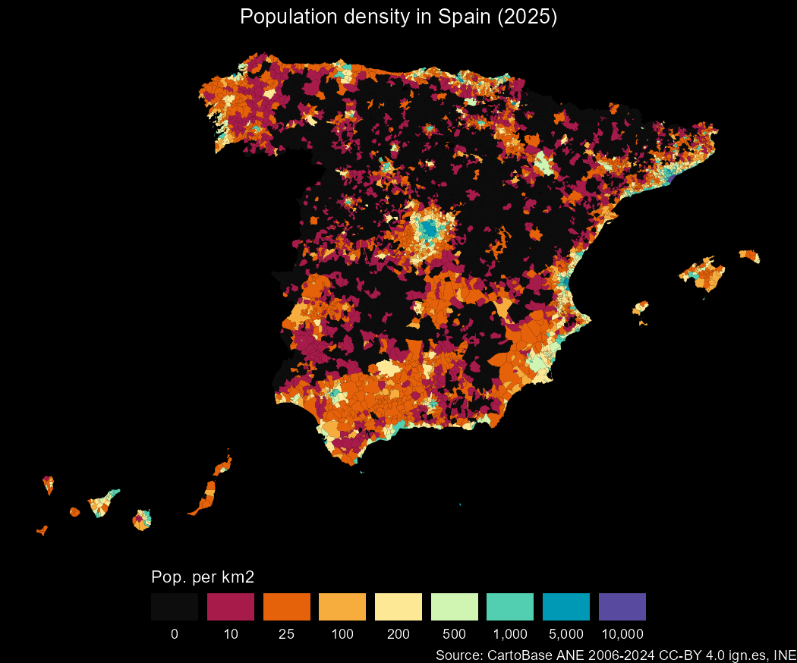
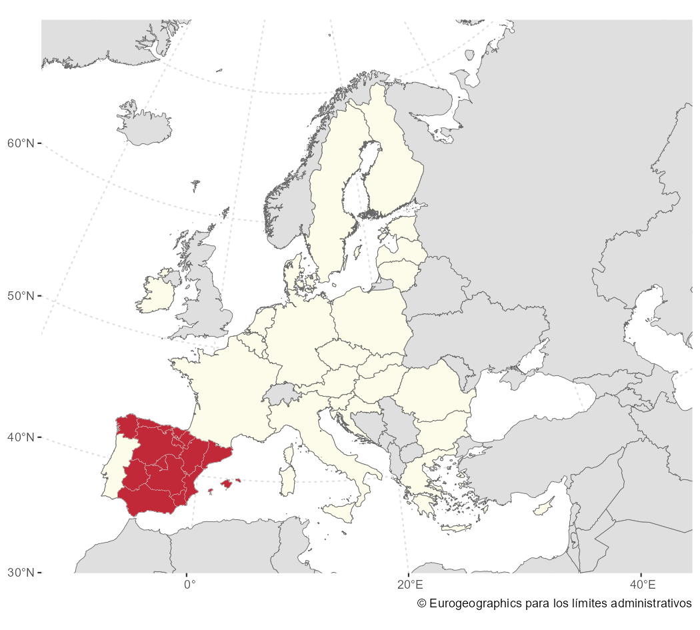

<!-- mapSpain.qmd is generated from mapSpain.qmd.orig. Please edit that file -->


## Introduction

::: callout-tip
For more examples and vignettes, see the full site at
<https://ropenspain.github.io/mapSpain/>.
:::

[**mapSpain**](https://ropenspain.github.io/mapSpain/) provides administrative
boundaries and static map tiles for Spain.

**mapSpain** provides **sf** objects for Autonomous Communities and Cities,
provinces, municipalities and NUTS levels in Spain. It also provides grid maps
and other complementary geometries, such as the demarcation lines around the
Canary Islands.

**mapSpain** provides access to static map tiles from Spanish public
administrations. Tiles can be represented on static maps with
`mapSpain::esp_get_tiles()` or on an R
[**leaflet**](https://rstudio.github.io/leaflet/) map using
`mapSpain::addProviderEspTiles()`.

**mapSpain** also includes a dictionary that translates Spanish subdivision
names to English, Spanish, Catalan, Basque and Galician, and converts them to
coding standards such as NUTS, ISO2 and INE codes.

## Caching

**mapSpain** provides data and tile caching. Set a cache directory with:


``` r
esp_set_cache_dir("./path/to/location")
```

**mapSpain** relies on [**giscoR**](https://ropengov.github.io/giscoR/) for
downloading some files, and both packages can share cache settings. Using the
same cache directory for both packages speeds up data loading in your session.

## Basic example

These examples show key **mapSpain** workflows:


``` r
library(mapSpain)
library(ggplot2)

country <- esp_get_spain()
lines <- esp_get_can_box()

ggplot(country) +
  geom_sf(fill = "cornsilk", color = "#887e6a") +
  labs(title = "Map of Spain") +
  theme(
    panel.background = element_rect(fill = "#fffff3"),
    panel.border = element_rect(
      colour = "#887e6a",
      fill = NA,
    ),
    text = element_text(
      family = "serif",
      face = "bold"
    )
  )
```

<div class="figure">

<p class="caption">Example: map of Spain</p>
</div>


``` r
# Plot provinces.

andalucia <- esp_get_prov_siane("Andalucia")

ggplot(andalucia) +
  geom_sf(fill = "darkgreen", color = "white") +
  theme_bw()
```

<div class="figure">

<p class="caption">Example: provinces of Andalusia</p>
</div>


``` r
# Plot municipalities.

euskadi_ccaa <- esp_get_ccaa_siane("Euskadi")
euskadi <- esp_get_munic_siane(region = "Euskadi")

# Use the dictionary.

euskadi$name_eu <- esp_dict_translate(euskadi$ine.prov.name, lang = "eu")

ggplot(euskadi_ccaa) +
  geom_sf(fill = "grey50") +
  geom_sf(data = euskadi, aes(fill = name_eu)) +
  scale_fill_manual(values = c("red2", "darkgreen", "ivory2")) +
  labs(
    fill = "",
    title = "Euskal Autonomia Erkidegoko",
    subtitle = "Probintziak"
  ) +
  theme_void() +
  theme(
    plot.title = element_text(face = "bold"),
    plot.subtitle = element_text(face = "italic")
  )
```

<div class="figure">

<p class="caption">Example: municipalities of the Basque Country</p>
</div>

## Choropleth and label maps

Analyze the distribution of women in each Autonomous Community or City with
**ggplot2**:


``` r
library(dplyr)

census <- mapSpain::pobmun25 |>
  select(-name)

# Extract Autonomous Community or City codes from the base dataset.
codelist <- mapSpain::esp_codelist |>
  select(cpro, codauto) |>
  distinct()

census_ccaa <- census |>
  left_join(codelist) |>
  # Summarize by Autonomous Community or City.
  group_by(codauto) |>
  summarise(pob25 = sum(pob25), men = sum(men), women = sum(women)) |>
  mutate(
    porc_women = women / pob25,
    porc_women_lab = paste0(round(100 * porc_women, 2), "%")
  )

# Merge into spatial data.
ccaa_sf <- esp_get_ccaa() |>
  left_join(census_ccaa)

can <- esp_get_can_box()

# Plot with ggplot.
library(ggplot2)

ggplot(ccaa_sf) +
  geom_sf(aes(fill = porc_women), color = "grey70", linewidth = 0.3) +
  geom_sf(data = can, color = "grey70") +
  geom_sf_label(
    aes(label = porc_women_lab),
    fill = "white",
    alpha = 0.5,
    size = 3,
    linewidth = 0
  ) +
  scale_fill_gradientn(
    colors = hcl.colors(10, "Blues", rev = TRUE),
    n.breaks = 10,
    labels = scales::label_percent(),
    guide = guide_legend(title = "% women", position = "inside")
  ) +
  theme_void() +
  theme(legend.position.inside = c(0.1, 0.6)) +
  labs(caption = "Source: CartoBase ANE 2006-2024 CC-BY 4.0 ign.es, INE")
```

<div class="figure">

<p class="caption">Percentage of women by Autonomous Community or City (2025)</p>
</div>

## Thematic maps

This example shows how **mapSpain** can be used to create thematic maps. For
plotting, we use the [**ggplot2**](https://ggplot2.tidyverse.org/) package,
though any package that works with `sf` objects, such as **tmap**, **mapsf** or
**leaflet**, could also be used.


``` r
# Calculate population density in Spain.
library(sf)

pop <- mapSpain::pobmun25 |>
  select(-name)

munic <- esp_get_munic_siane(rawcols = TRUE) |>
  # Use the area field available in the SIANE data.
  mutate(area_km2 = st_area_sh * 10000)

munic_pop <- munic |>
  left_join(pop) |>
  mutate(dens = pob25 / area_km2)

br <- c(-Inf, 10, 25, 100, 200, 500, 1000, 5000, 10000, Inf)

munic_pop$cuts <- cut(munic_pop$dens, br)

ggplot(munic_pop) +
  geom_sf(aes(fill = cuts), color = NA, linewidth = 0) +
  scale_fill_manual(
    values = c("grey5", hcl.colors(length(br) - 2, "Spectral")),
    labels = prettyNum(c(0, br[-1]), big.mark = ","),
    guide = guide_legend(
      title = "Pop. per km2",
      direction = "horizontal",
      nrow = 1
    )
  ) +
  labs(title = "Population density in Spain (2025)") +
  theme_void() +
  theme(
    plot.title = element_text(hjust = 0.5),
    plot.background = element_rect(fill = "black"),
    text = element_text(colour = "white"),
    legend.position = "bottom",
    legend.title.position = "top",
    legend.text.position = "bottom",
    legend.key.width = unit(30, "pt")
  ) +
  labs(caption = "Source: CartoBase ANE 2006-2024 CC-BY 4.0 ign.es, INE")
```

<div class="figure">

<p class="caption">Population density in Spain (2025)</p>
</div>

## mapSpain and giscoR

If you need to plot Spain alongside other countries, use the
[**giscoR**](https://ropengov.github.io/giscoR/) package, which is installed as
a dependency of **mapSpain**. Here is a basic example:


``` r
library(giscoR)

# Set the same resolution for a perfect fit.
res <- 3

all_countries <- gisco_get_countries(resolution = res) |>
  st_transform(3035)

eu_countries <- gisco_get_countries(
  resolution = res,
  region = "EU"
) |>
  st_transform(3035)

ccaa <- esp_get_ccaa(
  moveCAN = FALSE,
  resolution = res
) |>
  st_transform(3035)

# Plot.
ggplot(all_countries) +
  geom_sf(fill = "#DFDFDF", color = "#656565") +
  geom_sf(data = eu_countries, fill = "#FDFBEA", color = "#656565") +
  geom_sf(data = ccaa, fill = "#C12838", color = "grey80", linewidth = 0.1) +
  # Center on Europe: EPSG 3035.
  coord_sf(
    xlim = c(2377294, 7453440),
    ylim = c(1313597, 5628510)
  ) +
  theme(
    panel.background = element_blank(),
    panel.grid = element_line(
      colour = "#DFDFDF",
      linetype = "dotted"
    )
  ) +
  labs(caption = giscoR::gisco_attributions("es"))
```

<div class="figure">

<p class="caption">mapSpain and giscoR example</p>
</div>

## Working with static map tiles

**mapSpain** provides an interface for working with static map tiles. It can
download tiles as `.png` or `.jpeg`, depending on the tile service, and use them
alongside your **sf** objects.

**mapSpain** also includes a plugin for
[**leaflet**](https://rstudio.github.io/leaflet/) maps, which allows you to add
several basemaps to interactive maps.

The services are implemented with the
[leaflet-providersESP](https://dieghernan.github.io/leaflet-providersESP/)
Leaflet plugin. All available providers are listed there.

::: callout-note
When working with static map tiles, set `moveCAN = FALSE` in `esp_get_*()`
functions. See **Displacing the Canary Islands** in `esp_move_can()`.
:::
